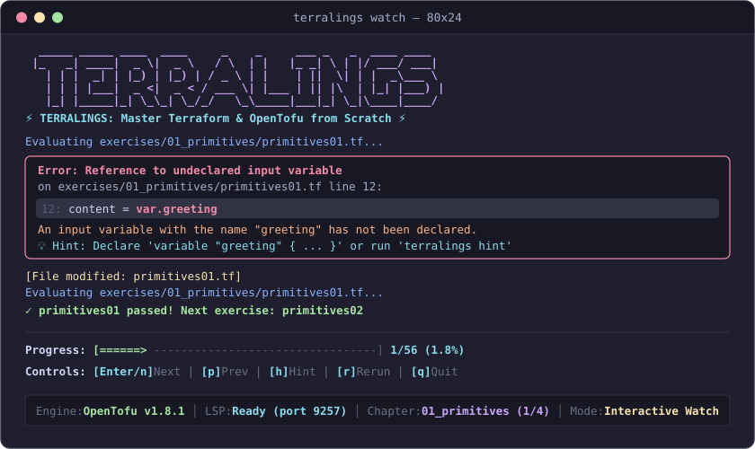

# Terralings

<p align="center">
  <a href="https://github.com/dnf0/terralings/actions"></a>
  <a href="LICENSE"></a>
  <a href="https://go.dev/"></a>
  <a href="https://opentofu.org/"></a>
  <a href="https://www.terraform.io/"></a>
  <a href="https://github.com/dnf0/terralings/tree/main/extensions/vscode"></a>
  <a href="https://dnf0.github.io/terralings/"></a>
</p>

<p align="center">
  
</p>

> **Master Terraform and OpenTofu from scratch through small, interactive, hands-on terminal exercises.**

`terralings` guides you through fixing broken configurations, writing declarative Infrastructure as Code (IaC), mastering HCL expressions and built-in functions, refactoring state with `moved` blocks, authoring `.tftest.hcl` unit and integration tests, configuring OpenTofu state encryption, and applying enterprise architecture governance standards.

Inspired by [`rustlings`](https://github.com/rust-lang/rustlings), [`ziglings`](https://github.com/ziglings/exercises), [`spanglings`](https://github.com/dnf0/spanglings), and [`raylings`](https://github.com/dnf0/raylings).

---

## Pedagogical Philosophy

Terralings is built on five core educational pillars:

1. **Active Debugging over Passive Reading**: Each exercise presents realistic broken or incomplete configuration code with clear `# TODO:` instructions. You learn by identifying compilation errors, diagnosing plan discrepancies, and writing working declarative code.
2. **Sub-30ms Hotkey Watcher Loop**: Powered by an ultra-fast file watcher (`fsnotify`), Terralings re-evaluates your changes immediately upon saving. Single-key interactive controls (`n` next, `p` prev, `h` hint, `r` rerun, `q` quit) ensure you never leave your flow state.
3. **Dual Engine Support**: Seamlessly detects and runs against either **OpenTofu** (`tofu` &ge; 1.6.0) or **Terraform** (`terraform` &ge; 1.5.0), ensuring universal applicability across open-source and enterprise toolchains.
4. **Progressive Hinting**: Multi-level contextual hints provide gentle conceptual nudges before revealing concrete syntax patterns, preserving the learning challenge without stalling progress.
5. **Zero-Friction Validation**: Terralings eliminates cumbersome "magic comments" or manual completion markers. Your code is validated directly against canonical parser checks, execution plans, and native test runners.

---

## Architecture Overview

Terralings is engineered in Go for extreme performance, offline reliability, and zero cloud credential requirements. The complete 56-exercise curriculum is embedded directly in the standalone binary.

```
                            +-----------------------+
                            |     User Terminal     |
                            +-----------+-----------+
                                        |
                                        v
                            +-----------------------+
                            |  Terralings CLI (Go)  |
                            +-----------+-----------+
                                        |
               +------------------------+------------------------+
               |                                                 |
               v                                                 v
   +-----------------------+                         +-----------------------+
   |  File Watcher Engine  |                         |  Bubble Tea TUI & UI  |
   |       (fsnotify)      |                         | (diagnostics / tree)  |
   +-----------+-----------+                         +-----------------------+
               |
               v
   +-----------------------+
   |  Curriculum Manifest  |  (13 Chapters / 56 Exercises)
   +-----------+-----------+
               |
               v
   +-----------------------+
   |   Exercise Runner     |
   +-----------+-----------+
               |
   +-----------+-----------+
   |                       |
   v                       v
+---------------+   +------------------+
|  OpenTofu CLI |   |  Terraform CLI   |
| (tofu binary) |   | (terraform bin)  |
+---------------+   +------------------+
```

---

## Prerequisites

Before using `terralings`, ensure you have installed:

1. **OpenTofu** (&ge; 1.6.0) or **Terraform** (&ge; 1.5.0):
   ```bash
   tofu version
   # or
   terraform version
   ```
2. *(Optional)* **Go** (&ge; 1.22) if building from source.

---

## Installation & Getting Started

### Option 1: 1-Line Installer (Linux & macOS)

Install the latest pre-built binary directly to `~/.local/bin` or `/usr/local/bin`:

```bash
curl -fsSL https://raw.githubusercontent.com/dnf0/terralings/main/install.sh | bash
```

### Option 2: Go Toolchain

If you have Go 1.22+ installed:

```bash
go install github.com/dnf0/terralings/cmd/terralings@latest
```

### Option 3: GitHub Releases Pre-built Binaries

Download pre-compiled archives for Linux (`amd64`, `arm64`), macOS (Apple Silicon `arm64`, Intel `amd64`), or Windows from [GitHub Releases](https://github.com/dnf0/terralings/releases).

### Option 4: Build from Source

```bash
git clone https://github.com/dnf0/terralings.git
cd terralings
make build
# Binary is located at ./bin/terralings
```

---

## Quickstart

Once installed, verify your environment, take the guided tour, and scaffold the exercises:

```bash
# 1. Run pre-flight health checks to verify your OpenTofu/Terraform setup
terralings doctor

# 2. Take the 2-minute interactive guided walkthrough
terralings tour

# 3. Initialize exercises in current directory (creates exercises/ folder)
terralings init

# 4. Start interactive learning loop (standard terminal stream)
terralings watch

# 5. Or launch the full-screen interactive TUI dashboard
terralings tui
# or
terralings watch -i
```

> 📖 **New to Terralings?** Check out the comprehensive [Documentation Suite](https://dnf0.github.io/terralings/) and [Onboarding Guide](https://dnf0.github.io/terralings/onboarding-guide/) for step-by-step instructions, editor configurations, and learning tips.

---

## Interactive Learning Commands

Terralings provides 15 dedicated subcommands tailored for learning, diagnostics, and developer productivity:

### 1. `terralings watch`

Start the continuous file watcher. Terralings monitors `exercises/` using `fsnotify` and re-evaluates the active exercise automatically whenever changes are saved to disk.

```bash
terralings watch [flags]
```

#### Interactive Single-Key Controls
When running in standard watch mode, the following interactive hotkeys are available:
- `n` or `Enter`: Advance to the next exercise
- `p`: Navigate back to the previous exercise
- `h`: Reveal the next progressive hint
- `r`: Manually re-run verification on the current exercise
- `q` or `Ctrl+C`: Quit watch mode

#### NDJSON Event Streaming (`--json`)
Stream real-time newline-delimited JSON events for editor plugins, CI pipelines, or headless runners:
```bash
terralings watch --json
```

---

### 2. `terralings tui` (or `terralings watch -i`)

Launch the full-screen interactive terminal dashboard powered by Bubble Tea and Lip Gloss.

```bash
terralings tui
```

- **Sidebar Navigation**: Visual tree of chapters and exercises with real-time pass/fail status markers.
- **Compiler Viewport**: Rich syntax diagnostics, error callouts, and plan execution output.
- **Collapsible Hints Drawer**: Press `h` to toggle multi-level hints directly inside the dashboard.
- **Search Modal**: Press `/` to trigger instant fuzzy search across all exercises.

---

### 3. `terralings tour`

Launch the 5-step guided onboarding walkthrough. Introduces core IaC concepts, the Terralings feedback loop, watch and TUI modes, progressive hinting, and editor LSP integration.

```bash
terralings tour [--step <n>] [--non-interactive] [--json]
```

---

### 4. `terralings doctor`

Execute comprehensive pre-flight diagnostic health checks to verify your system setup before starting exercises.

```bash
terralings doctor [--json]
```

```text
🩺 Terralings Doctor Diagnostic Report
────────────────────────────────────────────────────────────
 ✓ IaC Engine Binary       Found opentofu at /usr/local/bin/tofu (OpenTofu v1.8.0)
 ✓ Curriculum Scaffold     Exercises directory present (56 configuration files found)
 ✓ Provider Plugin Cache   Plugin cache directory ready at ~/.terralings/plugin-cache
 ✓ Git Ignore Integration  .terralings directory is properly git-ignored.
 ✓ Progress Store          State store healthy at .terralings/state.json
────────────────────────────────────────────────────────────
 All diagnostics passed! Your environment is 100% ready for Terralings.
```

---

### 5. `terralings run <exercise>`

Run standalone verification against a single exercise without starting watch mode.

```bash
terralings run primitives01
# or with explicit file path:
terralings run exercises/01_primitives/primitives01.tf
```

---

### 6. `terralings hint <exercise>`

Display progressive hints for an exercise. Earlier hints provide conceptual guidance, while later hints provide targeted syntax examples.

```bash
terralings hint primitives01
# View a specific hint level:
terralings hint primitives01 --index 1
```

---

### 7. `terralings reset <exercise>`

Restore an exercise file back to its initial starter template from embedded assets if you want to redo it from scratch.

```bash
terralings reset primitives01
```

---

### 8. `terralings search <query>`

Perform fast full-text search across all chapter titles, exercise names, descriptions, and progressive hints with relevance scoring.

```bash
terralings search dynamic
terralings search "state encryption"
```

---

### 9. `terralings list`

List all 13 curriculum chapters and 56 exercises with their current completion status indicators (`✓` passed, `•` in progress, `·` not started).

```bash
terralings list
```

---

### 10. `terralings verify`

Run a full evaluation pass across the entire curriculum and display an aggregated progress bar and chapter scorecard.

```bash
terralings verify
```

```text
Progress: [████████████████████████████████████████] 56/56 (100.0%)

🎉 Congratulations! You have completed all Terralings exercises! 🎉
```

---

### 11. `terralings stats`

Display learning analytics and progress metrics persisted in `.terralings/state.json`:

```bash
terralings stats
```

```text
📊 TERRALINGS LEARNING ANALYTICS

Overall Progress: [████████████░░░░░░░░] 60% (34/56 completed)
Time Invested:    1h 45m
Total Attempts:   82 (avg 1.5 per exercise)
Hints Consulted:  12
```

---

### 12. `terralings lsp`

Start the built-in Language Server Protocol (LSP) daemon over standard input/output (`stdio`). Implements JSON-RPC 2.0 LSP specifications for code diagnostics (`publishDiagnostics`), hover tooltips (`textDocument/hover`), and hint code actions (`textDocument/codeAction`) in Neovim, Helix, and VS Code.

```bash
terralings lsp
```

---

### 13. `terralings completion`

Generate shell autocompletion scripts with dynamic exercise name suggestions:

```bash
# Bash
terralings completion bash > /etc/bash_completion.d/terralings

# Zsh
terralings completion zsh > "${fpath[1]}/_terralings"

# Fish
terralings completion fish > ~/.config/fish/completions/terralings.fish

# PowerShell
terralings completion powershell | Out-String | Invoke-Expression
```

---

### Global Flags & Environment Variables

| Option / Variable | Description |
|---|---|
| `--bin <path>` / `TERRALINGS_BIN` | Explicit path override to `tofu` or `terraform` executable |
| `--state <path>` / `TERRALINGS_STATE_PATH` | Path override for progress store (default: `.terralings/state.json`) |
| `TERRALINGS_PLUGIN_CACHE_DIR` | Shared provider plugin cache directory (default: `~/.terralings/plugin-cache`) |
| `NO_COLOR` | Disables ANSI color escape sequences in terminal output |

---

## Official VS Code Companion Extension

Terralings includes an official companion extension located in [`extensions/vscode`](extensions/vscode):

<p align="center">
  
</p>

- **Curriculum & Exercise Explorer**: Dedicated Activity Bar sidebar displaying all 13 chapters and 56 exercises with real-time status badges (`Passed`, `Failed`, `In Progress`, `Not Started`), chapter progress counters (`5/5`), and one-click file navigation.
- **Embedded Language Server (LSP)**: Automatic connection to `terralings lsp` for live diagnostics, markdown hover documentation with exercise objectives and progressive hints, and code actions.
- **Interactive Guided Walkthroughs**: 5-step native onboarding tour introducing IaC philosophy, exercise anatomy, watch mode, TUI dashboard, and LSP capabilities.
- **Terminal & TUI Integration**: Direct command palette launchers for continuous watch mode (`terralings watch`) and the full-screen terminal dashboard (`terralings tui`).
- **Live Status Bar**: Real-time curriculum progress indicator with quick-jump search.

### Local Installation

```bash
cd extensions/vscode
npm install
npm run build

# Package and install into VS Code
npx @vscode/vsce package
code --install-extension terralings-vscode-0.3.0.vsix
```

---

## Curriculum Matrix

The curriculum spans **13 structured chapters** containing **56 exercises**:

| Chapter | Exercise ID | Title | Mode | Key Concepts Tested |
|---|---|---|:---:|---|
| **01 Primitives** | `primitives01` | Terraform Configuration Block | `validate` | `terraform` block, `required_version`, `required_providers`, provider sources |
| | `primitives02` | First Resource Declaration | `plan` | `resource` block syntax, resource types, labels, required attributes |
| | `primitives03` | Resource Dependencies | `plan` | Implicit dependency graphs, attribute referencing (`<type>.<name>.<attr>`) |
| | `primitives04` | String Interpolation & Heredoc | `plan` | String templates (`${...}`), indented heredocs (`<<-EOT`), escaping |
| | `primitives05` | Syntax & Formatting | `validate` | Canonical HCL formatting, alignment, valid quotes, syntax validation |
| | `primitives06` | Lifecycle Mechanics | `plan` | `terraform_data`, `triggers_replace`, forced resource recreation mechanics |
| **02 Variables** | `variables01` | Primitive Variable Declarations | `validate` | `variable` blocks, `string`, `number`, `bool`, `description` metadata |
| | `variables02` | Collection Types | `plan` | `list(string)`, `map(string)`, `set(string)`, indexing (`[0]`, `["key"]`) |
| | `variables03` | Structural Types | `validate` | `object({...})`, `optional(type, default)`, `tuple([...])` constraints |
| | `variables04` | Defaults and Nullable | `plan` | Default variable values, `nullable = false`, handling null assignments |
| | `variables05` | Custom Variable Validations | `plan` | `validation` blocks, `condition` expressions, `error_message` formatting |
| **03 Outputs & Locals** | `outputs01` | Defining Outputs & Sensitive Redaction | `plan` | `output` blocks, `value`, `description`, `sensitive = true` log masking |
| | `locals01` | Locals for Intermediate Calculations | `plan` | `locals { ... }`, computed values, referencing `local.<name>` |
| | `expr01` | Ternary Conditional Expressions | `plan` | Ternary operators (`cond ? true_val : false_val`), type unification |
| | `expr02` | Splat Expressions | `plan` | Splat operators (`[*]`), extracting attribute lists across collections |
| **04 Functions** | `func01` | String Manipulation Functions | `plan` | `format()`, `join()`, `split()`, `replace()`, `lower()`, `upper()` |
| | `func02` | Collection Operations | `plan` | `merge()`, `lookup()`, `distinct()`, `slice()`, `flatten()`, `zipmap()` |
| | `func03` | Data Encodings | `plan` | `jsonencode()`, `jsondecode()`, `yamlencode()`, `base64encode()` |
| | `func04` | Filesystem Functions | `plan` | `file()`, `templatefile()`, `fileset()`, `fileexists()`, path modules |
| | `func05` | Safe Evaluation Expressions | `plan` | `try()`, `can()`, dynamic fallback expressions, guarding edge cases |
| **05 Meta-Arguments** | `meta01` | Scaling Resources with Count | `plan` | `count = <n>`, `count.index`, referencing indexed resource instances |
| | `meta02` | Idempotent Mapping with For Each | `plan` | `for_each = toset(...)`, `each.key`, `each.value`, avoiding index churn |
| | `meta03` | Explicit Dependency Ordering | `plan` | `depends_on = [...]`, managing non-attribute execution ordering |
| | `meta04` | Resource Lifecycle Blocks | `plan` | `lifecycle { create_before_destroy, prevent_destroy }` zero-downtime rules |
| | `meta05` | Dynamic Drift Handling | `plan` | `lifecycle { ignore_changes = [...] }`, ignoring out-of-band updates |
| **06 Dynamic Blocks** | `dynamic01` | Basic Dynamic Block Iteration | `plan` | `dynamic "block" { for_each = ... content { ... } }`, `.value` access |
| | `dynamic02` | Dynamic Blocks with Custom Iterator | `plan` | `iterator = custom_name`, referencing `custom_name.key` and `.value` |
| | `dynamic03` | Nested Dynamic Blocks | `plan` | Hierarchical dynamic blocks, nesting content blocks within parents |
| | `dynamic04` | Conditional Dynamic Block Emission | `plan` | Conditionally passing empty collections `[]` to emit zero blocks |
| **07 Data Sources** | `data01` | Local Filesystem Data Sources | `plan` | `data "local_file"`, reading files into configuration state |
| | `data02` | Archive File Data Sources | `plan` | `data "archive_file"`, building lambda/deploy packages on the fly |
| | `data03` | External Data Source Queries | `plan` | `data "external"`, executing local scripts and parsing JSON outputs |
| | `data04` | Custom Preconditions and Postconditions | `plan` | `lifecycle { precondition { ... } postcondition { ... } }` |
| **08 Modules** | `module01` | Building a Clean Child Module | `validate` | Module structure (`main.tf`, `variables.tf`, `outputs.tf`), encapsulation |
| | `module02` | Calling Local Child Modules | `plan` | `module "<name>" { source = "./..." }`, passing arguments, referencing outputs |
| | `module03` | Multi-Instance Module Deployment | `plan` | `for_each` inside module blocks, addressing multi-instance outputs |
| | `module04` | Passing Provider Configurations & Aliases | `plan` | `providers = { ... }`, `configuration_aliases` in `required_providers` |
| | `module05` | Submodule Boundaries & Clean Architecture | `validate` | Decoupled module hierarchy, flat interfaces, antipattern prevention |
| **09 State Refactoring** | `state01` | Declarative Refactoring with Moved Blocks | `plan` | `moved { from = ... to = ... }`, non-destructive resource renaming |
| | `state02` | Migrating Count to For-Each with Moved Blocks | `plan` | Converting `resource[0]` to `resource["key"]` without recreation |
| | `state03` | Declarative Import Blocks | `plan` | `import { to = ... id = "..." }`, onboarding unmanaged cloud resources |
| | `state04` | Controlled Resource Replacement | `plan` | `lifecycle { replace_triggered_by = [...] }`, dependency-driven teardowns |
| **10 Native Testing** | `test01` | Basic Test Assertions with Run Blocks | `test` | `.tftest.hcl`, `run { command = plan }`, `assert { condition, error_message }` |
| | `test02` | Validating Applied Resources in Tests | `test` | `run { command = apply }`, testing provisioned outputs and contract values |
| | `test03` | Mocking Providers and Resources | `test` | `mock_provider`, `override_resource`, zero-cloud unit testing suites |
| | `test04` | Testing Failure Cases with Expect Failures | `test` | `expect_failures = [var.<name>]`, validating defensive validation blocks |
| **11 Patterns** | `pattern01` | Multi-Environment Configuration Mapping | `plan` | Environment dictionaries in `locals`, dynamic sizing & tiered config |
| | `pattern02` | Feature Flags & Conditional Resource Creation | `plan` | `count = var.flag ? 1 : 0`, `one()`, `try()`, optional resource patterns |
| | `pattern03` | Tagging Factory Pattern | `plan` | Merging base tags, environment tags, and custom metadata via `merge()` |
| | `pattern04` | Self-Service Input Contracts | `plan` | Structured variable contracts, comprehensions with filter predicates |
| **12 OpenTofu** | `tofu01` | State Encryption at Rest | `plan` | `terraform { encryption { key_provider, method, state } }` |
| | `tofu02` | Early Variable Evaluation | `plan` | Referencing `var.<name>` in early-evaluated provider and backend blocks |
| | `tofu03` | OpenTofu Public Registry Integration | `validate` | Open registry provider sources, interoperability, required versions |
| **13 Governance** | `gov01` | Root Module Encapsulation | `plan` | Zero loose resources in root environments, modular workload encapsulation |
| | `gov02` | Policy Encapsulation (ADR-0005) | `plan` | Resource-owned policy ARNs, eliminating inline IAM wildcard grants |
| | `gov03` | Ephemeral Workload Isolation | `plan` | Encapsulating batch/tooling compute to prevent root state pollution |

---

## The `*lings` Ecosystem

Terralings is part of the `*lings` family of interactive, developer-grade terminal learning tools:

- ☸️ [**Kubelings**](https://github.com/dnf0/kubelings) – Master Kubernetes through hands-on terminal exercises.
- 🇪🇸 [**Spanglings**](https://github.com/dnf0/spanglings) – Developer-grade CLI & interactive TUI for learning intermediate-to-advanced Spanish (B1–C1).
- ⚡ [**Raylings**](https://github.com/dnf0/raylings) – Learn distributed AI, Ray Core actors, and scalable clusters through hands-on Python exercises.

---

## Development & Testing

For contributors looking to build, test, or extend Terralings:

```bash
# Run all format checks, linters, tests, and extension builds
make all

# Run unit and curriculum tests with race detection
make test-race

# Run formatting checks across Go code and solutions
make check

# Build the terralings binary
make build
```

---

## Contributing

Contributions are welcome! Please read [CONTRIBUTING.md](CONTRIBUTING.md) for details on our code of conduct, development workflow, and pull request guidelines.

---

## License

This project is licensed under the Apache License 2.0 - see the [LICENSE](LICENSE) file for details.

