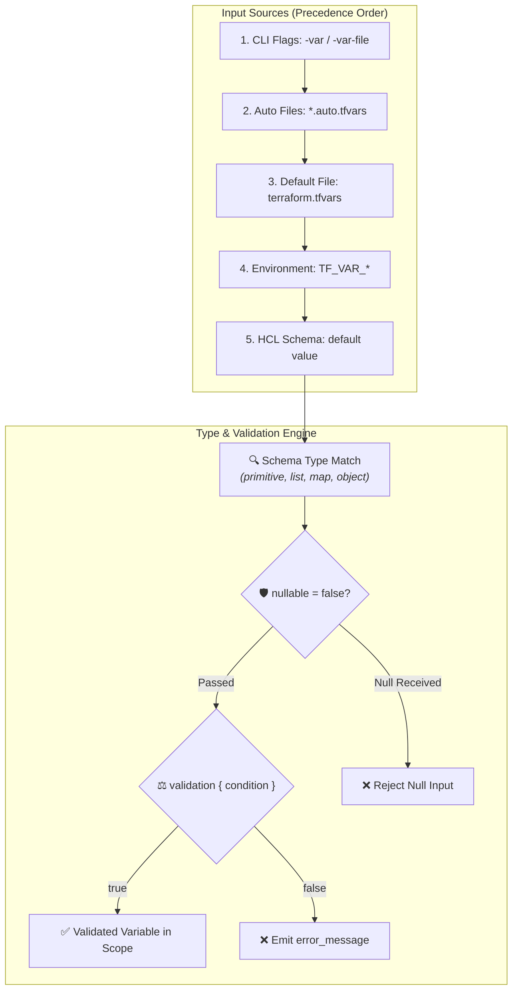

# Chapter 02: Input Variables, Types & Validations

<div class="grid cards" markdown>

-   :material-school: **Topic Focus** &bull; Type Constraints, Collections, Object Schemas, and Custom Validations
-   :material-api: **Primary Primitives** &bull; `variable`, `validation`, `type`, `optional()`
-   :material-rocket-launch: [**Launch Playground in Wasm →**](../playground/index.html?chapter=2){ .md-button .md-button--primary }

</div>

---

## 1. Architectural Overview & Type System Mechanics

In modern Terraform and OpenTofu, **Input Variables** define the external parameterization contract for modules and configurations. The type system validates input contracts at initialization time before any resources are planned or provisioned.



When variable values are passed via CLI flags (`-var`), `.tfvars` files, or environment variables (`TF_VAR_name`), the engine executes a three-stage validation pipeline:
1. **Type Constraint Matching**: Ensures values strictly conform to primitive, collection, or object constraints.
2. **Nullability Checks**: If `nullable = false` is defined, the engine rejects `null` inputs and falls back to default values.
3. **Custom Validation Predicates**: Executes all `condition` expressions inside `validation` blocks, raising custom `error_message` strings if a condition evaluates to `false`.

---

## 2. Annotated Production HCL Anatomy & Field Reference

Below is a production-grade variable declaration demonstrating structural types, optional attributes with defaults, and defensive regex validation rules:

```hcl
variable "database_cluster" {
  description = "Production cluster deployment configuration with networking and scaling rules."
  type = object({
    cluster_name = string
    tier         = string
    node_count   = number
    maintenance = optional(object({
      window_day  = string
      window_hour = number
    }), {
      window_day  = "Sun"
      window_hour = 3
    })
    tags = optional(map(string), {})
  })

  default = {
    cluster_name = "primary-db"
    tier         = "db.r6g.xlarge"
    node_count   = 3
  }

  nullable = false

  validation {
    condition     = contains(["db.t4g.medium", "db.r6g.large", "db.r6g.xlarge"], var.database_cluster.tier)
    error_message = "The tier must be one of: db.t4g.medium, db.r6g.large, or db.r6g.xlarge."
  }

  validation {
    condition     = var.database_cluster.node_count >= 1 && var.database_cluster.node_count <= 16
    error_message = "The cluster node_count must be between 1 and 16 instances."
  }
}
```

### Key Field Schema Reference

| Field / Block | Type | Description |
| :--- | :--- | :--- |
| `type` | `Type Constraint` | Declares allowed types (`string`, `number`, `bool`, `list`, `map`, `set`, `object`, `tuple`). |
| `default` | `Any` | Fallback value if no explicit argument is supplied by the caller. |
| `description` | `String` | Documentation explaining the purpose, expected format, and constraints of the variable. |
| `sensitive` | `Boolean` | Masks the variable value in console outputs, CLI diffs, and log streams. |
| `nullable` | `Boolean (Default: true)` | When set to `false`, assigning `null` will trigger a fallback to `default` or raise an error. |
| `validation.condition` | `Boolean Expression` | HCL boolean expression that must evaluate to `true` for the input to be accepted. |
| `validation.error_message` | `String` | Human-readable explanation returned when `condition` fails (must be complete sentences). |
| `optional(type, default)` | `Type Modifier` | Marks an object attribute as optional and optionally defines its default value. |

---

## 3. Real-World Architectural Patterns

### Pattern 1: Multi-Attribute Object Validation with Regex

```hcl
variable "environment_tag" {
  type        = string
  description = "Deployment target environment stage."

  validation {
    condition     = can(regex("^(dev|staging|prod)-[a-z]{2}-[0-9]$", var.environment_tag))
    error_message = "Environment tag must follow the naming convention '<stage>-<region>-<id>' (e.g., 'prod-eu-1')."
  }
}
```

### Pattern 2: Structural Network Subnet Contract

```hcl
variable "subnets" {
  type = map(object({
    cidr_block        = string
    availability_zone = string
    is_public         = optional(bool, false)
  }))
  description = "Map of subnet keys to their CIDR configuration and AZ placement."

  validation {
    condition = alltrue([
      for k, v in var.subnets : can(cidrnetmask(v.cidr_block))
    ])
    error_message = "All configured subnet blocks must be valid IPv4 CIDR notations."
  }
}
```

---

## 4. Production Hardening & Operational Governance

- **Always Declare Explicit Types**: Avoid `type = any`. Unconstrained types push runtime validation errors into deep resource creation steps.
- **Provide Actionable Error Messages**: In `validation` blocks, explain exactly what was expected and list valid enum options.
- **Guard Against Null Injections**: Set `nullable = false` on variables with default maps or objects to avoid runtime `null` dereference crashes.
- **Use `optional()` for Progressive Expansion**: Use `optional(type, default)` in object schemas so callers only override attributes they care about.

---

## 5. Failure Modes & Diagnostic Triage Tree

??? failure "Error: Invalid value for variable (`Condition failed`)"
    **Root Cause:** The provided value violated one or more `validation` block expressions.

    **Diagnostic Triage Sequence:**
    1. Read the custom `error_message` output in the CLI.
    2. Check the condition logic against your input value in `terraform.tfvars`.
    3. Test expressions interactively using `tofu console` or `terraform console`.

??? failure "Error: Invalid type constraint or uncoercible value"
    **Root Cause:** A value passed to a variable cannot be coerced into the required type constraint (e.g. passing a string to `type = number` or missing required object keys).

    **Diagnostic Triage Sequence:**
    1. Inspect the variable's `type = object({...})` signature.
    2. Ensure all non-optional object attributes are explicitly present in the input map.
    3. Verify list/map element types match the inner type constraint.

??? failure "Error: Variable value is null with `nullable = false`"
    **Root Cause:** A caller explicitly passed `null` to a variable configured with `nullable = false` that has no default value.

    **Diagnostic Triage Sequence:**
    1. Check calling module arguments for explicit `null` passes.
    2. Provide a default fallback value in the variable block or supply a non-null literal.

---

## 6. Interactive Practice Matrix

Practice concepts from this chapter directly in the interactive WebAssembly sandbox:

| Exercise ID | Challenge Description | Direct Link | Action |
| :--- | :--- | :--- | :--- |
| **`variables01`** | Primitive Variable Declarations | [`../playground/index.html?exercise=variables01`](../playground/index.html?exercise=variables01) | [**⚡ Solve in Playground →**](../playground/index.html?exercise=variables01){ .md-button .md-button--primary } |
| **`variables02`** | Collection Types | [`../playground/index.html?exercise=variables02`](../playground/index.html?exercise=variables02) | [**⚡ Solve in Playground →**](../playground/index.html?exercise=variables02){ .md-button .md-button--primary } |
| **`variables03`** | Structural Types | [`../playground/index.html?exercise=variables03`](../playground/index.html?exercise=variables03) | [**⚡ Solve in Playground →**](../playground/index.html?exercise=variables03){ .md-button .md-button--primary } |
| **`variables04`** | Defaults and Nullable | [`../playground/index.html?exercise=variables04`](../playground/index.html?exercise=variables04) | [**⚡ Solve in Playground →**](../playground/index.html?exercise=variables04){ .md-button .md-button--primary } |
| **`variables05`** | Custom Variable Validations | [`../playground/index.html?exercise=variables05`](../playground/index.html?exercise=variables05) | [**⚡ Solve in Playground →**](../playground/index.html?exercise=variables05){ .md-button .md-button--primary } |
