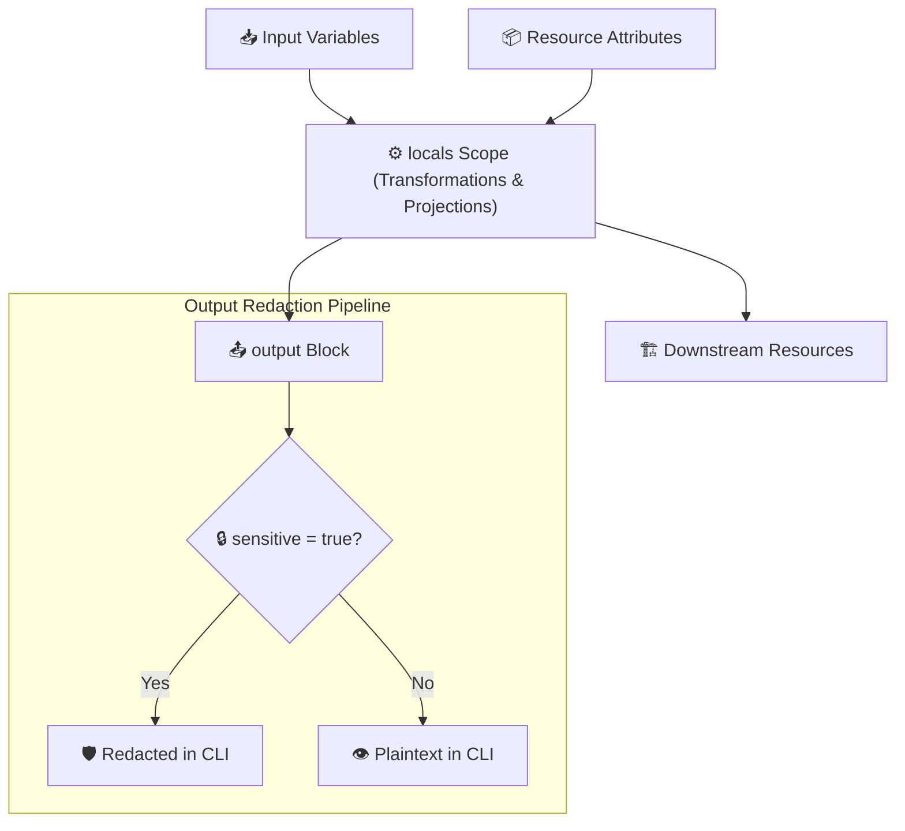

# Chapter 03: Outputs, Locals & Expressions

<div class="grid cards" markdown>

-   :material-school: **Topic Focus** &bull; State Export, Sensitive Masking, Intermediate Locals, Ternary Logic, and Splat Operators
-   :material-api: **Primary Primitives** &bull; `output`, `locals`, `[*]`, `? :`, `sensitive`
-   :material-rocket-launch: [**Launch Playground in Wasm →**](../playground/index.html?chapter=3){ .md-button .md-button--primary }

</div>

---

## 1. Architectural Overview & Data Flow Mechanics

In Terraform and OpenTofu, **Outputs, Locals & Expressions** manage data flow and transformations across resource boundaries. While `output` blocks expose state to callers and CLI consumers, `locals` blocks encapsulate intermediate computations to keep configurations DRY (Don't Repeat Yourself).



Expressions are evaluated during graph resolution:
1. **Locals Scope**: Evaluated dynamically and cached for repeated references within the same module scope.
2. **Conditional Expressions**: `condition ? true_val : false_val` evaluate lazily, returning a single type-unified value.
3. **Splat Operators**: `[*]`, legacy `.*`, and `[for x in list : x.attr]` project nested list attributes into flat collections.
4. **Output Masking**: Outputs marked with `sensitive = true` are redacted from CLI output and plan summaries, but remain unencrypted in state files.

---

## 2. Annotated Production HCL Anatomy & Field Reference

Below is a production-grade configuration demonstrating intermediate local computations, sensitive output masking, and conditional expressions:

```hcl
variable "environment" {
  type    = string
  default = "production"
}

variable "db_password" {
  type      = string
  sensitive = true
}

# Intermediate calculations and consolidated tag factories
locals {
  is_production = var.environment == "production"
  tier_prefix   = local.is_production ? "prd" : "dev"

  cluster_name = "${local.tier_prefix}-core-cluster"

  common_tags = {
    Environment = var.environment
    ManagedBy   = "Terralings"
    Cluster     = local.cluster_name
  }
}

resource "terraform_data" "db_instance" {
  input = {
    name     = local.cluster_name
    password = var.db_password
    tags     = local.common_tags
  }
}

# Exposed outputs with sensitive masking
output "cluster_identifier" {
  description = "The normalized cluster identifier for downstream service consumption."
  value       = terraform_data.db_instance.input.name
}

output "db_credentials" {
  description = "Sensitive database connection credentials."
  value = {
    cluster  = terraform_data.db_instance.input.name
    password = terraform_data.db_instance.input.password
  }
  sensitive = true
}
```

### Key Field Schema Reference

| Field / Block | Type | Description |
| :--- | :--- | :--- |
| `locals { ... }` | `Block` | Defines module-scoped computed values and reusable intermediate expressions. |
| `output.<name>.value` | `Expression` | The exported value exposed to parent modules or CLI queries (`terraform output`). |
| `output.<name>.sensitive` | `Boolean` | Masks the output value as `(sensitive value)` in CLI outputs and logs. |
| `output.<name>.description` | `String` | Documentation explaining the purpose and contract of the exported output. |
| `output.<name>.depends_on` | `List(References)` | Explicit dependencies that must complete before the output expression is evaluated. |
| `[*] (Splat)` | `Operator` | Projects an attribute from every element in a list (e.g. `aws_instance.web[*].id`). |

---

## 3. Real-World Architectural Patterns

### Pattern 1: Splat Projections vs For Comprehensions

```hcl
# Resource scaling via count
resource "terraform_data" "servers" {
  count = 3
  input = {
    hostname = "srv-0${count.index + 1}.internal"
    ip       = "10.0.1.${10 + count.index}"
  }
}

# Splat operator extraction
output "all_hostnames" {
  value = terraform_data.servers[*].input.hostname
}

# Advanced filtering with for comprehension
output "filtered_ips" {
  value = [
    for s in terraform_data.servers : s.input.ip
    if s.input.hostname != "srv-01.internal"
  ]
}
```

### Pattern 2: Nested Ternary Evaluation with Default Fallbacks

```hcl
variable "replica_count_override" {
  type    = number
  default = null
}

locals {
  # Cascading fallback ternary expression
  effective_replicas = var.replica_count_override != null ? var.replica_count_override : (
    local.is_production ? 5 : 1
  )
}
```

---

## 4. Production Hardening & Operational Governance

- **Mask All Secret Derivatives**: Any output or local expression derived from a `sensitive` input variable automatically inherits the sensitive flag and must be marked `sensitive = true`.
- **Prevent Output Sprawl**: Only export outputs required by root callers or child modules. Excessive outputs increase state file size and lock in internal implementation details.
- **Normalize Environment Constants in `locals`**: Centralize environment prefixes, naming schemes, and common tags in `locals` rather than scattering ternaries throughout resource definitions.
- **Remember: State Stores Secrets in Plaintext**: `sensitive = true` masks secrets from terminal display, but values are stored in the state file. Protect backend state storage with encryption.

---

## 5. Failure Modes & Diagnostic Triage Tree

??? failure "Error: Output refers to sensitive values (`sensitive = true` required)"
    **Root Cause:** An `output` block references a sensitive variable, resource attribute, or data source without setting `sensitive = true`.

    **Diagnostic Triage Sequence:**
    1. Inspect the referenced attribute in the output `value` definition.
    2. Add `sensitive = true` directly to the `output` block definition.
    3. If the value is safe to expose, use `nonsensitive(expr)` with caution.

??? failure "Error: Inconsistent conditional result types in ternary operator"
    **Root Cause:** The `true_val` and `false_val` expressions in a ternary operator return incompatible types that cannot be automatically unified.

    **Diagnostic Triage Sequence:**
    1. Verify that both branches return the same type (e.g. both strings, or both lists).
    2. Explicitly cast or convert types using `tostring()`, `tolist()`, or `tomap()`.

??? failure "Error: Invalid splat expression target"
    **Root Cause:** Using `[*]` on a value that is not a list, tuple, or set.

    **Diagnostic Triage Sequence:**
    1. Check if the target is a single object or map rather than a list.
    2. For single objects, use direct attribute lookup (e.g. `res.attr`).
    3. For maps, use `values(map)[*].attr` or a `for` comprehension `[for k, v in map : v.attr]`.

---

## 6. Interactive Practice Matrix

Practice concepts from this chapter directly in the interactive WebAssembly sandbox:

| Exercise ID | Challenge Description | Direct Link | Action |
| :--- | :--- | :--- | :--- |
| **`outputs01`** | Defining Outputs & Sensitive Redaction | [`../playground/index.html?exercise=outputs01`](../playground/index.html?exercise=outputs01) | [**⚡ Solve in Playground →**](../playground/index.html?exercise=outputs01){ .md-button .md-button--primary } |
| **`locals01`** | Locals for Intermediate Calculations | [`../playground/index.html?exercise=locals01`](../playground/index.html?exercise=locals01) | [**⚡ Solve in Playground →**](../playground/index.html?exercise=locals01){ .md-button .md-button--primary } |
| **`expr01`** | Ternary Conditional Expressions | [`../playground/index.html?exercise=expr01`](../playground/index.html?exercise=expr01) | [**⚡ Solve in Playground →**](../playground/index.html?exercise=expr01){ .md-button .md-button--primary } |
| **`expr02`** | Splat Expressions | [`../playground/index.html?exercise=expr02`](../playground/index.html?exercise=expr02) | [**⚡ Solve in Playground →**](../playground/index.html?exercise=expr02){ .md-button .md-button--primary } |
