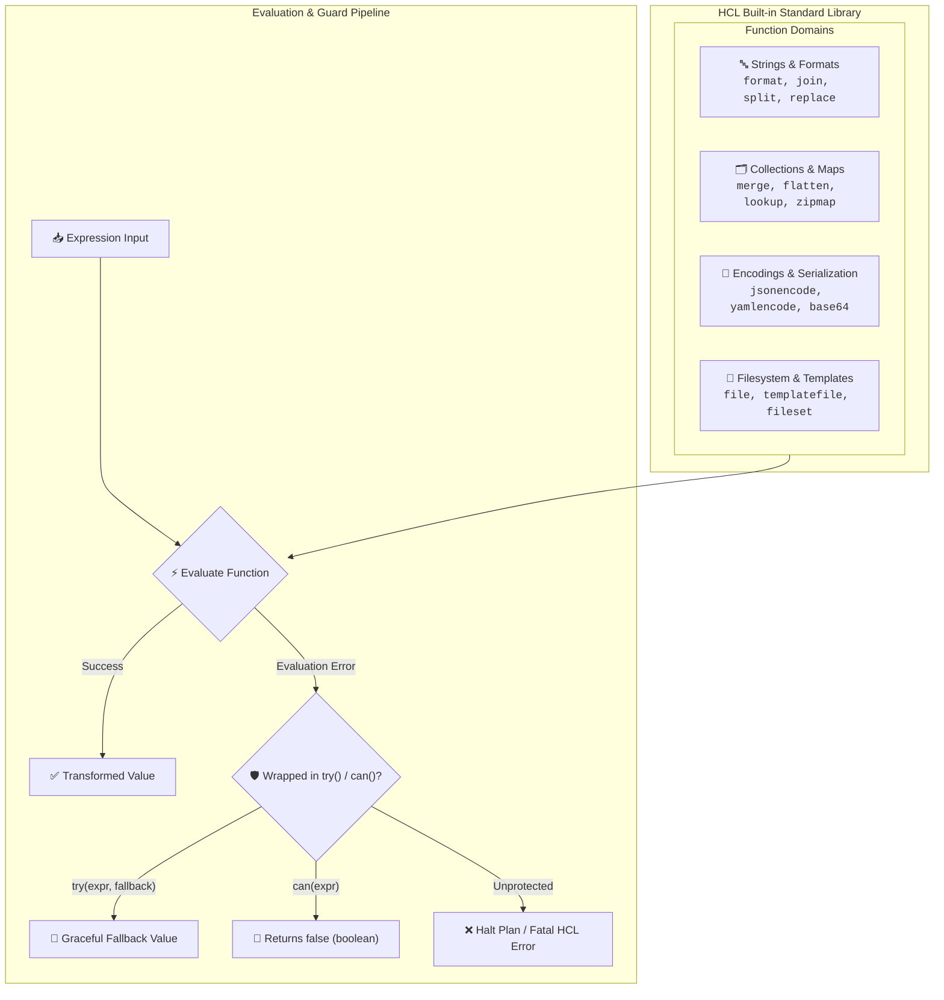

# Chapter 04: Built-in Functions & Collections

<div class="grid cards" markdown>

-   :material-school: **Topic Focus** &bull; String Ops, Collection Math, Encodings, Filesystem, and Safe Evaluation
-   :material-api: **Primary Functions** &bull; `merge`, `flatten`, `jsonencode`, `templatefile`, `try`, `can`
-   :material-rocket-launch: [**Launch Playground in Wasm →**](../playground/index.html?chapter=4){ .md-button .md-button--primary }

</div>

---

## 1. Architectural Overview & Function Engine

In Terraform and OpenTofu, **Built-in Functions** provide a deterministic, side-effect-free standard library for manipulating data structures, formatting strings, encoding data, and interacting with filesystem templates. HCL does not allow user-defined functions; all transformations execute via the built-in standard library.



Function characteristics:
1. **Deterministic Execution**: All functions are purely functional and idempotent. Calling a function with identical inputs always produces identical outputs.
2. **Compile-Time Safety**: When inputs are statically known, function evaluation occurs during the validation and planning phases.
3. **Safe Evaluation Guards**: `try()` and `can()` allow graceful handling of unknown attributes, dynamic maps, or type mismatches without terminating execution.

---

## 2. Annotated Production HCL Anatomy & Field Reference

Below is a production-grade configuration demonstrating data encoding, collection flattening, templating, and defensive error handling:

```hcl
variable "raw_config_json" {
  type    = string
  default = "{\"services\": [{\"name\": \"auth\", \"port\": 8080}, {\"name\": \"api\", \"port\": 8081}]}"
}

variable "additional_tags" {
  type    = map(string)
  default = { Team = "Security" }
}

locals {
  # Safe decoding and fallback parsing
  decoded_config = try(jsondecode(var.raw_config_json), { services = [] })

  # Collection transformation and flattening
  service_matrix = flatten([
    for s in local.decoded_config.services : [
      for env in ["dev", "prod"] : {
        key  = "${s.name}-${env}"
        name = s.name
        env  = env
        port = s.port
      }
    ]
  ])

  # Zipmap creation and tag merging
  service_port_map = zipmap(
    local.service_matrix[*].key,
    local.service_matrix[*].port
  )

  final_tags = merge(
    { Environment = "global", ManagedBy = "Terralings" },
    var.additional_tags
  )
}

resource "local_file" "service_manifest" {
  filename = "${path.module}/dist/services.json"
  content  = jsonencode({
    services = local.service_matrix
    ports    = local.service_port_map
    metadata = local.final_tags
  })
  file_permission = "0644"
}
```

### Key Function Reference Table

| Category | Function | Signature | Description |
| :--- | :--- | :--- | :--- |
| **Collections** | `merge` | `merge(maps...) -> map` | Combines multiple maps into a single map with right-precedence. |
| **Collections** | `flatten` | `flatten(list) -> list` | Flattens multidimensional lists into a single flat list. |
| **Collections** | `lookup` | `lookup(map, key, default) -> val` | Safely retrieves a map element with an optional fallback default. |
| **Encodings** | `jsonencode` | `jsonencode(value) -> string` | Serializes an HCL object into a strict JSON string. |
| **Encodings** | `jsondecode` | `jsondecode(string) -> any` | Deserializes a JSON string into native HCL maps, lists, and scalars. |
| **Filesystem** | `templatefile` | `templatefile(path, vars) -> string` | Reads an external template file and renders it with variables. |
| **Defensive** | `try` | `try(expr1, expr2, ...) -> val` | Evaluates expressions in order, returning the first one that does not error. |
| **Defensive** | `can` | `can(expression) -> bool` | Evaluates an expression and returns `true` if it succeeds, `false` otherwise. |

---

## 3. Real-World Architectural Patterns

### Pattern 1: Multi-Environment Template Rendering

```hcl
resource "local_file" "application_yaml" {
  filename = "${path.module}/config/app.yaml"
  content = templatefile("${path.module}/templates/app.yaml.tftpl", {
    app_name        = "payment-gateway"
    database_host   = "db.internal.net"
    enable_profiler = true
    allowed_cidrs   = ["10.0.0.0/16", "172.16.0.0/12"]
  })
}
```

### Pattern 2: Defensive Nested Map Extraction with `try` and `can`

```hcl
variable "untrusted_payload" {
  type    = any
  default = {}
}

locals {
  # Safely extract deeply nested key or fallback
  max_retries = try(var.untrusted_payload.settings.network.retry_limit, 3)

  # Validate structure before referencing
  has_valid_auth = can(var.untrusted_payload.auth.tokens[0])
}
```

---

## 4. Production Hardening & Operational Governance

- **Always Prefer `jsonencode` Over Manual String Formatting**: Never write manual JSON strings with string interpolation (`"{\"name\": \"${var.name}\"}"`). Manual formatting breaks on quotes and special characters; always use `jsonencode()`.
- **Use `templatefile` for Large Configurations**: Keep shell scripts, IAM policy documents, and application configurations in dedicated `.tftpl` template files rather than inline heredocs.
- **Scope `try()` Deliberately**: Avoid wrapping massive blocks of code in `try()`. Narrow `try()` calls to the specific attribute that might fail to avoid masking unintended bugs.
- **Normalize File Paths with `path.module`**: Always prefix relative file paths with `${path.module}/` or `${path.root}/` to ensure consistent resolution regardless of CLI working directory.

---

## 5. Failure Modes & Diagnostic Triage Tree

??? failure "Error: Invalid function argument / Call to unknown function"
    **Root Cause:** Function name is misspelled or passed argument types/counts do not match the function signature.

    **Diagnostic Triage Sequence:**
    1. Check function name spelling and arguments in the official HCL docs.
    2. Test function behavior interactively in `tofu console` or `terraform console`.
    3. Ensure input collections are non-null and match expected container types.

??? failure "Error: Error in function call: `jsondecode` / `yamlencode` syntax error"
    **Root Cause:** A string passed to `jsondecode()` is malformed or invalid JSON.

    **Diagnostic Triage Sequence:**
    1. Validate the source JSON payload using `jq` or an online linter.
    2. Wrap the decode call with `try(jsondecode(var.payload), fallback_map)`.
    3. Verify that upstream strings do not contain unescaped control characters.

??? failure "Error: Cannot read file / No such file or directory in `file()`"
    **Root Cause:** The path provided to `file()` or `templatefile()` is relative to the wrong working directory.

    **Diagnostic Triage Sequence:**
    1. Prepend `${path.module}/` to ensure paths resolve relative to the current `.tf` file directory.
    2. Use `fileexists("${path.module}/path/to/file")` to verify existence before loading.

---

## 6. Interactive Practice Matrix

Practice concepts from this chapter directly in the interactive WebAssembly sandbox:

| Exercise ID | Challenge Description | Direct Link | Action |
| :--- | :--- | :--- | :--- |
| **`func01`** | String Manipulation Functions | [`../playground/index.html?exercise=func01`](../playground/index.html?exercise=func01) | [**⚡ Solve in Playground →**](../playground/index.html?exercise=func01){ .md-button .md-button--primary } |
| **`func02`** | Collection Operations | [`../playground/index.html?exercise=func02`](../playground/index.html?exercise=func02) | [**⚡ Solve in Playground →**](../playground/index.html?exercise=func02){ .md-button .md-button--primary } |
| **`func03`** | Data Encodings | [`../playground/index.html?exercise=func03`](../playground/index.html?exercise=func03) | [**⚡ Solve in Playground →**](../playground/index.html?exercise=func03){ .md-button .md-button--primary } |
| **`func04`** | Filesystem Functions | [`../playground/index.html?exercise=func04`](../playground/index.html?exercise=func04) | [**⚡ Solve in Playground →**](../playground/index.html?exercise=func04){ .md-button .md-button--primary } |
| **`func05`** | Safe Evaluation Expressions | [`../playground/index.html?exercise=func05`](../playground/index.html?exercise=func05) | [**⚡ Solve in Playground →**](../playground/index.html?exercise=func05){ .md-button .md-button--primary } |
