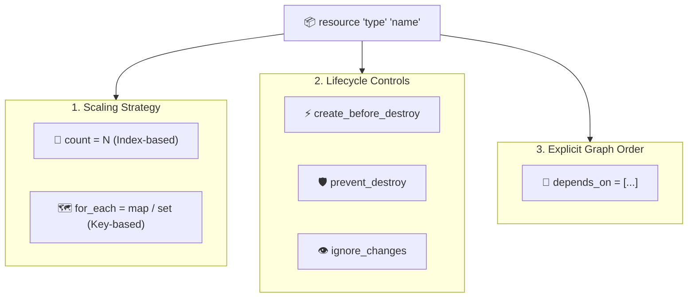

# Chapter 05: Meta-Arguments & Resource Scaling

<div class="grid cards" markdown>

-   :material-school: **Topic Focus** &bull; `count`, `for_each`, Explicit `depends_on`, `lifecycle` Rules, and Drift
-   :material-api: **Primary Meta-Arguments** &bull; `count`, `for_each`, `depends_on`, `lifecycle`
-   :material-rocket-launch: [**Launch Playground in Wasm →**](../playground/index.html?chapter=5){ .md-button .md-button--primary }

</div>

---

## 1. Architectural Overview & Scaling Mechanics

In Terraform and OpenTofu, **Meta-Arguments** are engine-level directives applicable to any resource or module block. They control how many instances are generated, how dependencies are sequenced, and how the resource lifecycle responds to changes and drift.



### 🔍 Diagram Concept Breakdown

- **Scaling Strategy (`count` vs `for_each`)**:
  - **`count = N`**: Replicates resources based on an integer count. Addresses resources as `type.name[index]`. Useful for simple boolean toggles (`count = var.enabled ? 1 : 0`), but removing items from lists shifts indices, causing destructive recreations.
  - **`for_each = map/set`**: Replicates resources based on unique map or set keys. Addresses resources as `type.name["key"]`. Adding, modifying, or removing items isolates changes strictly to that key without affecting peers.
- **Lifecycle Controls**:
  - **`create_before_destroy = true`**: Reverses the default destroy-then-create replacement order, creating the replacement resource first to ensure zero-downtime infrastructure updates.
  - **`prevent_destroy = true`**: Guardrail that causes `terraform plan` / `terraform apply` to exit with an error if a destroy operation is detected (protecting production databases and storage).
  - **`ignore_changes = [...]`**: Instructs the plan engine to ignore differences between state and real-world attributes (e.g. autoscale instance counts or external tags) to eliminate perpetual drift diffs.
- **Explicit Graph Ordering (`depends_on`)**:
  - Injects a strict directed edge into the DAG when hidden or out-of-band dependencies exist (such as waiting for an IAM role policy attachment to propagate before creating an EKS cluster).

---

## 2. Annotated Production HCL Anatomy & Field Reference

Below is a production-grade configuration demonstrating idempotent `for_each` mapping, explicit graph dependencies, and lifecycle rules:

```hcl
variable "storage_buckets" {
  type = map(object({
    purpose      = string
    retention_days = number
  }))
  default = {
    "logs"    = { purpose = "access-logging", retention_days = 90 }
    "backups" = { purpose = "database-dumps", retention_days = 365 }
    "assets"  = { purpose = "static-media",   retention_days = 30 }
  }
}

# Prerequisites resource
resource "terraform_data" "kms_key" {
  input = {
    key_alias = "alias/storage-encryption-key"
    status    = "enabled"
  }
}

# Scaled resources mapped by unique map keys
resource "terraform_data" "buckets" {
  for_each = var.storage_buckets

  input = {
    bucket_name    = "acme-corp-${each.key}"
    purpose        = each.value.purpose
    retention_days = each.value.retention_days
    encryption_key = terraform_data.kms_key.id
  }

  # Explicit graph ordering
  depends_on = [
    terraform_data.kms_key
  ]

  lifecycle {
    # Zero-downtime replacement
    create_before_destroy = true

    # Prevent accidental destruction in production
    prevent_destroy = false

    # Ignore drift on external tags
    ignore_changes = [
      input["retention_days"]
    ]
  }
}
```

### Key Meta-Arguments Reference Table

| Meta-Argument | Type | Description |
| :--- | :--- | :--- |
| `count` | `Number` | Multiplies the resource by an integer index. Addressable via `[count.index]`. |
| `for_each` | `Map` or `Set(String)` | Multiplies the resource by keys. Addressable via `[each.key]`. |
| `depends_on` | `List(References)` | Explicitly declares dependencies when implicit attribute references do not exist. |
| `lifecycle.create_before_destroy` | `Boolean` | Creates new resource replacement before destroying existing one. |
| `lifecycle.prevent_destroy` | `Boolean` | Rejects any plan that would destroy this resource (safety net for DBs/storage). |
| `lifecycle.ignore_changes` | `List(Attributes) | all` | Ignores out-of-band changes to specified attributes during plan comparison. |
| `lifecycle.replace_triggered_by` | `List(References)` | Forces recreation of this resource when referenced resource changes. |

---

## 3. Real-World Architectural Patterns

### Pattern 1: `count` for Conditional Toggling vs `for_each` for Scaling

```hcl
variable "enable_bastion" {
  type    = bool
  default = false
}

# Conditional 0 or 1 instance toggle
resource "terraform_data" "bastion_host" {
  count = var.enable_bastion ? 1 : 0
  input = {
    hostname = "bastion.internal"
    role     = "jumpbox"
  }
}
```

### Pattern 2: Dynamic `ignore_changes` for Autoscaling Drift

```hcl
resource "terraform_data" "web_cluster" {
  input = {
    desired_capacity = 3
    ami_id           = "ami-0123456789"
  }

  lifecycle {
    # Ignore desired_capacity drift caused by AWS Auto Scaling Groups
    ignore_changes = [
      input["desired_capacity"]
    ]
  }
}
```

---

## 4. Production Hardening & Operational Governance

- **Prefer `for_each` Over `count` for Multi-Instance Resources**: Use `for_each` whenever instances have individual identities or are derived from lists/maps. Use `count` exclusively for 0/1 boolean feature toggling.
- **Convert Lists to Sets Explicitly**: When passing a list of strings to `for_each`, always wrap with `toset(var.list)` to ensure unique, unordered key addressing.
- **Use `prevent_destroy` on Production Data Stores**: Protect production databases, storage accounts, and KMS keys with `prevent_destroy = true`.
- **Minimize Explicit `depends_on`**: Rely on implicit attribute references whenever possible. Overusing `depends_on` reduces parallel graph walking efficiency.

---

## 5. Failure Modes & Diagnostic Triage Tree

??? failure "Error: Invalid `for_each` argument (Type error / Sensitive / Unknown value)"
    **Root Cause:** A `for_each` expression evaluates to a list without `toset()`, contains dynamic unknown values from other resources, or contains sensitive data.

    **Diagnostic Triage Sequence:**
    1. If the input is a `list(string)`, wrap with `for_each = toset(var.my_list)`.
    2. If the keys depend on computed attributes of other resources (e.g. IDs), refactor so the keys are known before plan time.
    3. Ensure no sensitive values are used as map or set keys.

??? failure "Error: Resource destruction blocked by `prevent_destroy`"
    **Root Cause:** A planned configuration change would delete a resource protected by `lifecycle { prevent_destroy = true }`.

    **Diagnostic Triage Sequence:**
    1. Review the plan to verify why the resource is being deleted or replaced.
    2. If destruction is intentional, temporarily set `prevent_destroy = false` and re-apply.
    3. Re-enable `prevent_destroy = true` once the refactoring is complete.

??? failure "Error: Unexpected resource recreation (The 'Index Shift' Problem)"
    **Root Cause:** An item was removed from the beginning or middle of a list passed to `count`, causing all downstream instances to change index.

    **Diagnostic Triage Sequence:**
    1. Check if the resource uses `count` instead of `for_each`.
    2. Refactor the resource to use `for_each = toset(...)`.
    3. Use `moved` blocks to migrate existing state addresses non-destructively.

---

## 6. Interactive Practice Matrix

Practice concepts from this chapter directly in the interactive WebAssembly sandbox:

| Exercise ID | Challenge Description | Direct Link | Action |
| :--- | :--- | :--- | :--- |
| **`meta01`** | Scaling Resources with Count | [`../playground/index.html?exercise=meta01`](../playground/index.html?exercise=meta01) | [**⚡ Solve in Playground →**](../playground/index.html?exercise=meta01){ .md-button .md-button--primary } |
| **`meta02`** | Idempotent Mapping with For Each | [`../playground/index.html?exercise=meta02`](../playground/index.html?exercise=meta02) | [**⚡ Solve in Playground →**](../playground/index.html?exercise=meta02){ .md-button .md-button--primary } |
| **`meta03`** | Explicit Dependency Ordering | [`../playground/index.html?exercise=meta03`](../playground/index.html?exercise=meta03) | [**⚡ Solve in Playground →**](../playground/index.html?exercise=meta03){ .md-button .md-button--primary } |
| **`meta04`** | Resource Lifecycle Blocks | [`../playground/index.html?exercise=meta04`](../playground/index.html?exercise=meta04) | [**⚡ Solve in Playground →**](../playground/index.html?exercise=meta04){ .md-button .md-button--primary } |
| **`meta05`** | Dynamic Drift Handling | [`../playground/index.html?exercise=meta05`](../playground/index.html?exercise=meta05) | [**⚡ Solve in Playground →**](../playground/index.html?exercise=meta05){ .md-button .md-button--primary } |
