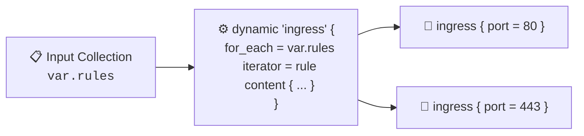

# Chapter 06: Dynamic Blocks & Advanced HCL

<div class="grid cards" markdown>

-   :material-school: **Topic Focus** &bull; `dynamic` Blocks, Custom Iterators, Hierarchical Nesting, and Conditional Emission
-   :material-api: **Primary Primitives** &bull; `dynamic`, `content`, `iterator`, `for_each`
-   :material-rocket-launch: [**Launch Playground in Wasm →**](../playground/index.html?chapter=6){ .md-button .md-button--primary }

</div>

---

## 1. Architectural Overview & Dynamic Block Expansion

In Terraform and OpenTofu, **Dynamic Blocks** generate repeated, nested configuration blocks inside resource, data source, or provider declarations. Unlike top-level `for_each` which replicates whole resources, dynamic blocks replicate inner structural blocks (e.g. `ingress`, `tag`, `setting`).



Core Rules:
1. **Scope of Application**: Dynamic blocks only work inside block bodies. They cannot generate top-level blocks like `resource` or `variable`.
2. **Conditional Emission**: Passing an empty collection (`[]` or `{}`) evaluates to zero generated blocks, allowing clean conditional omission.
3. **Custom Iterators**: Setting `iterator = <name>` avoids naming conflicts when nesting dynamic blocks inside other dynamic blocks.

---

## 2. Annotated Production HCL Anatomy & Field Reference

Below is a production-grade configuration demonstrating nested dynamic blocks, custom iterators, and conditional rule generation:

```hcl
variable "security_rules" {
  type = map(object({
    description = string
    port        = number
    protocol    = string
    cidr_blocks = list(string)
  }))
  default = {
    "http"  = { description = "HTTP Web",  port = 80,  protocol = "tcp", cidr_blocks = ["0.0.0.0/0"] }
    "https" = { description = "HTTPS Web", port = 443, protocol = "tcp", cidr_blocks = ["0.0.0.0/0"] }
    "ssh"   = { description = "SSH Admin", port = 22,  protocol = "tcp", cidr_blocks = ["10.0.0.0/8"] }
  }
}

variable "enable_monitoring_block" {
  type    = bool
  default = true
}

resource "terraform_data" "firewall_group" {
  input = {
    group_name = "production-app-firewall"
  }

  # Dynamic block generation using custom iterator
  dynamic "provisioner" {
    for_each = var.security_rules
    iterator = rule

    content {
      name        = rule.key
      description = rule.value.description
      port        = rule.value.port
      protocol    = rule.value.protocol
      cidrs       = rule.value.cidr_blocks
    }
  }

  # Conditional block emission using ternary collection
  dynamic "provisioner" {
    for_each = var.enable_monitoring_block ? [1] : []
    iterator = mon

    content {
      name        = "telemetry-agent"
      description = "Prometheus Metrics Exporter"
      port        = 9100
      protocol    = "tcp"
      cidrs       = ["10.200.0.0/16"]
    }
  }
}
```

### Key Field Schema Reference

| Field / Block | Type | Description |
| :--- | :--- | :--- |
| `dynamic "<type>"` | `Block` | Target nested block type name to dynamically generate. |
| `for_each` | `Collection` | List, map, or set of values to iterate over. |
| `iterator` | `Identifier (Optional)` | Custom variable name for the current element (defaults to the dynamic block label). |
| `content { ... }` | `Block` | The template body of the nested block. References iterator via `<name>.key` and `<name>.value`. |
| `<iterator>.key` | `String / Number` | Key of map item or index of list element in current iteration. |
| `<iterator>.value` | `Any` | The value of the collection item in the current iteration. |

---

## 3. Real-World Architectural Patterns

### Pattern 1: Hierarchical Multi-Level Nested Dynamic Blocks

```hcl
variable "widget_trees" {
  type = list(object({
    category = string
    items = list(object({
      name  = string
      color = string
    }))
  }))
  default = [
    {
      category = "header"
      items    = [{ name = "logo", color = "blue" }]
    }
  ]
}

resource "terraform_data" "ui_config" {
  dynamic "provisioner" {
    for_each = var.widget_trees
    iterator = cat

    content {
      name = cat.value.category

      # Nested dynamic block within outer content block
      dynamic "provisioner" {
        for_each = cat.value.items
        iterator = item

        content {
          name  = item.value.name
          color = item.value.color
        }
      }
    }
  }
}
```

### Pattern 2: Conditional Log Shipping Dynamic Block

```hcl
variable "log_destination_bucket" {
  type    = string
  default = ""
}

resource "terraform_data" "storage_service" {
  input = { service_name = "core-storage" }

  # Emits block only when bucket string is non-empty
  dynamic "provisioner" {
    for_each = var.log_destination_bucket != "" ? [var.log_destination_bucket] : []
    iterator = target_bucket

    content {
      target_bucket = target_bucket.value
      prefix        = "access-logs/"
    }
  }
}
```

---

## 4. Production Hardening & Operational Governance

- **Use Dynamic Blocks Sparingly**: Overuse makes HCL difficult to read and audit. If a block is always static, write it out explicitly.
- **Always Name Nested Iterators**: When nesting dynamic blocks, always specify `iterator = custom_name` to prevent the inner loop from shadowing the outer iterator.
- **Validate Collections Upstream**: Ensure collections passed to `dynamic` blocks have explicit type constraints on variables to prevent runtime iteration crashes.

---

## 5. Failure Modes & Diagnostic Triage Tree

??? failure "Error: Unknown variable or attribute in dynamic content"
    **Root Cause:** Referencing `<type>.value` when a custom `iterator = ...` has been defined, or attempting to access non-existent object attributes on `.value`.

    **Diagnostic Triage Sequence:**
    1. Check if an `iterator` label is defined. If `iterator = item`, use `item.value`, not `dynamic_name.value`.
    2. Inspect the structure of the `for_each` collection elements to verify attribute names.

??? failure "Error: The `dynamic` block type cannot be used here"
    **Root Cause:** Placing a `dynamic` block at the root level or inside a block that does not accept nested sub-blocks.

    **Diagnostic Triage Sequence:**
    1. Verify that the dynamic block is inside a `resource`, `data`, or `provider` block body.
    2. Check the provider documentation to ensure the target block is a repeatable nested block, not an attribute.

---

## 6. Interactive Practice Matrix

Practice concepts from this chapter directly in the interactive WebAssembly sandbox:

| Exercise ID | Challenge Description | Direct Link | Action |
| :--- | :--- | :--- | :--- |
| **`dynamic01`** | Basic Dynamic Block Iteration | [`../playground/index.html?exercise=dynamic01`](../playground/index.html?exercise=dynamic01) | [**⚡ Solve in Playground →**](../playground/index.html?exercise=dynamic01){ .md-button .md-button--primary } |
| **`dynamic02`** | Dynamic Blocks with Custom Iterator | [`../playground/index.html?exercise=dynamic02`](../playground/index.html?exercise=dynamic02) | [**⚡ Solve in Playground →**](../playground/index.html?exercise=dynamic02){ .md-button .md-button--primary } |
| **`dynamic03`** | Nested Dynamic Blocks | [`../playground/index.html?exercise=dynamic03`](../playground/index.html?exercise=dynamic03) | [**⚡ Solve in Playground →**](../playground/index.html?exercise=dynamic03){ .md-button .md-button--primary } |
| **`dynamic04`** | Conditional Dynamic Block Emission | [`../playground/index.html?exercise=dynamic04`](../playground/index.html?exercise=dynamic04) | [**⚡ Solve in Playground →**](../playground/index.html?exercise=dynamic04){ .md-button .md-button--primary } |
