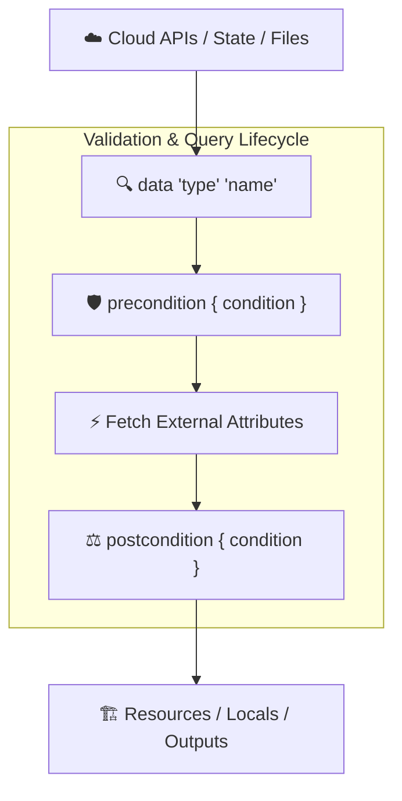

# Chapter 07: Data Sources & State Querying

<div class="grid cards" markdown>

-   :material-school: **Topic Focus** &bull; Read-Only State, External Queries, Archive Generation, and Pre/Postconditions
-   :material-api: **Primary Primitives** &bull; `data`, `precondition`, `postcondition`, `lifecycle`
-   :material-rocket-launch: [**Launch Playground in Wasm →**](../playground/index.html?chapter=7){ .md-button .md-button--primary }

</div>

---

## 1. Architectural Overview & Read-Only Query Lifecycle

In Terraform and OpenTofu, **Data Sources** allow configurations to query information defined outside of the current management scope. Data sources are strictly read-only; they fetch data during the refresh/plan phase and make it available to resources, locals, and outputs.



### 🔍 Diagram Concept Breakdown

- **External Data Providers (`Sources`)**: Interfaces with external systems such as cloud provider control planes (AWS, GCP, Azure), remote backend state files (`terraform_remote_state`), or local disk artifacts.
- **Data Source Declaration (`data "<type>" "<name>"`)**: Defines a read-only query contract without declaring resource ownership or lifecycle management.
- **Validation & Query Lifecycle**:
  - **`precondition` gate**: Validates assumptions about input query arguments *before* the external API call is dispatched.
  - **Fetch External Attributes**: The provider issues read calls during `terraform refresh` / `terraform plan` (or defers to `apply` if arguments depend on pending resource attributes).
  - **`postcondition` gate**: Validates assertions against the retrieved attributes (e.g., verifying that returned AMI images have virtualization type `hvm` and state `available`) before exposing data downstream.
- **Downstream Consumers**: Supplies safe, validated, read-only attributes to downstream managed resources, `locals`, and `output` blocks.

---

## 2. Annotated Production HCL Anatomy & Field Reference

Below is a production-grade configuration demonstrating data source queries, filesystem archive creation, and defensive precondition contracts:

```hcl
variable "min_security_compliance_level" {
  type    = number
  default = 3
}

# Local file data source query
data "local_file" "release_manifest" {
  filename = "${path.module}/release.json"
}

# External JSON script query with defensive contract
data "external" "cluster_telemetry" {
  program = ["bash", "-c", "echo '{\"active_nodes\":\"5\", \"compliance_level\":\"4\"}'"]

  lifecycle {
    # Contract evaluated before query execution
    precondition {
      condition     = var.min_security_compliance_level >= 1
      error_message = "Minimum security compliance level must be at least 1."
    }

    # Invariant checked against queried data
    postcondition {
      condition     = tonumber(self.result.compliance_level) >= var.min_security_compliance_level
      error_message = "External cluster fails required compliance level."
    }
  }
}

# Archive generation data source
data "archive_file" "lambda_payload" {
  type        = "zip"
  output_path = "${path.module}/dist/payload.zip"
  source {
    content  = data.local_file.release_manifest.content
    filename = "manifest.json"
  }
}

resource "terraform_data" "deployment" {
  input = {
    archive_hash = data.archive_file.lambda_payload.output_base64sha256
    node_count   = tonumber(data.external.cluster_telemetry.result.active_nodes)
  }
}
```

### Key Field Schema Reference

| Field / Block | Type | Description |
| :--- | :--- | :--- |
| `data "<type>" "<name>"` | `Block` | Declares a read-only data query managed by a provider plugin. |
| `data.*.result` | `Map(String)` | Standard return map for `data "external"` queries. |
| `lifecycle.precondition` | `Block` | Invariant condition evaluated BEFORE resource/data query is planned or executed. |
| `lifecycle.postcondition` | `Block` | Invariant condition evaluated AFTER resource/data query is executed. References `self`. |
| `self.<attr>` | `Reference` | Self-referencing keyword inside `postcondition` blocks to inspect evaluated attributes. |

---

## 3. Real-World Architectural Patterns

### Pattern 1: Lambda Archive Packaging with Hash-Driven Triggers

```hcl
data "archive_file" "service_bundle" {
  type        = "zip"
  source_dir  = "${path.module}/src"
  output_path = "${path.module}/build/bundle.zip"
}

resource "terraform_data" "function_deployment" {
  input = {
    bundle_hash = data.archive_file.service_bundle.output_base64sha256
  }

  lifecycle {
    # Force replacement whenever source code bundle hash changes
    triggers_replace = [
      data.archive_file.service_bundle.output_base64sha256
    ]
  }
}
```

### Pattern 2: Precondition Guard on VPC Subnet Availability

```hcl
variable "target_cidr" {
  type    = string
  default = "10.0.0.0/16"
}

resource "terraform_data" "network_allocation" {
  input = { cidr = var.target_cidr }

  lifecycle {
    precondition {
      condition     = can(cidrnetmask(var.target_cidr))
      error_message = "Invalid CIDR mask format provided."
    }
  }
}
```

---

## 4. Production Hardening & Operational Governance

- **Avoid Deferred Data Sources When Possible**: Passing unknown computed attributes to data sources forces their execution into the apply phase, preventing complete plan visibility.
- **Enforce Invariants with `postcondition`**: Use `postcondition` to verify external system contracts (e.g. confirming that an queried VPC has DNS support enabled).
- **Treat `data "external"` as a Last Resort**: External script data sources introduce non-deterministic dependencies on host shell environments and external runtimes.

---

## 5. Failure Modes & Diagnostic Triage Tree

??? failure "Error: Resource Precondition / Postcondition Failed"
    **Root Cause:** The condition expression inside a `precondition` or `postcondition` evaluated to `false`.

    **Diagnostic Triage Sequence:**
    1. Read the custom `error_message` returned in the plan output.
    2. Inspect the queried values or inputs to determine why the invariant was violated.
    3. Update external infrastructure or adjust input parameters to meet the contract.

??? failure "Error: `data.external` program returned invalid JSON or non-zero exit code"
    **Root Cause:** The external script failed, printed non-JSON text to stdout, or returned non-string dictionary values.

    **Diagnostic Triage Sequence:**
    1. Run the external script manually in your terminal with identical arguments.
    2. Ensure the script prints strictly valid single-level JSON key-value pairs of strings (e.g. `{"key":"val"}`).
    3. Ensure stderr output is redirected if the CLI binary emits debug logs.

---

## 6. Interactive Practice Matrix

Practice concepts from this chapter directly in the interactive WebAssembly sandbox:

| Exercise ID | Challenge Description | Direct Link | Action |
| :--- | :--- | :--- | :--- |
| **`data01`** | Local Filesystem Data Sources | [`../playground/index.html?exercise=data01`](../playground/index.html?exercise=data01) | [**⚡ Solve in Playground →**](../playground/index.html?exercise=data01){ .md-button .md-button--primary } |
| **`data02`** | Archive File Data Sources | [`../playground/index.html?exercise=data02`](../playground/index.html?exercise=data02) | [**⚡ Solve in Playground →**](../playground/index.html?exercise=data02){ .md-button .md-button--primary } |
| **`data03`** | External Data Source Queries | [`../playground/index.html?exercise=data03`](../playground/index.html?exercise=data03) | [**⚡ Solve in Playground →**](../playground/index.html?exercise=data03){ .md-button .md-button--primary } |
| **`data04`** | Custom Preconditions and Postconditions | [`../playground/index.html?exercise=data04`](../playground/index.html?exercise=data04) | [**⚡ Solve in Playground →**](../playground/index.html?exercise=data04){ .md-button .md-button--primary } |
