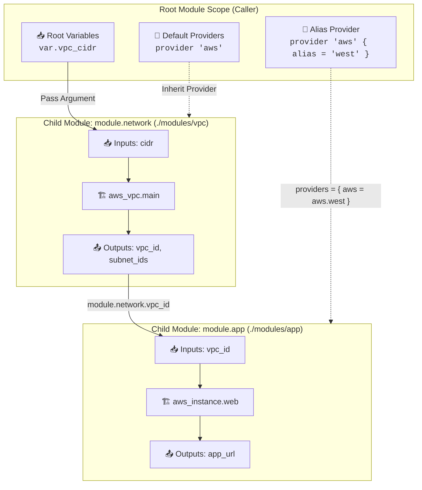

# Chapter 08: Modular Infrastructure Architecture

<div class="grid cards" markdown>

-   :material-school: **Topic Focus** &bull; Child Modules, Multi-Instance `for_each`, Provider Aliases, and Clean Boundaries
-   :material-api: **Primary Primitives** &bull; `module`, `providers`, `configuration_aliases`, `source`
-   :material-rocket-launch: [**Launch Playground in Wasm →**](../playground/index.html?chapter=8){ .md-button .md-button--primary }

</div>

---

## 1. Architectural Overview & Modular Composition

In Terraform and OpenTofu, **Modules** are the foundational unit of abstraction, encapsulation, and code reuse. Every configuration has at least one root module (the directory containing your active `.tf` files) and can instantiate child modules locally or from remote registries.



Core Architectural Rules:
1. **Encapsulation Boundary**: Child modules cannot access variables or resources from the parent scope unless passed explicitly as input arguments.
2. **Provider Aliases**: Reusable child modules must declare `configuration_aliases` inside `terraform.required_providers` when requiring caller-supplied provider configurations.
3. **Flat Composition over Deep Nesting**: Prefer flat sibling composition in the root module over deeply nested multi-tier module hierarchies.

---

## 2. Annotated Production HCL Anatomy & Field Reference

Below is a production-grade configuration demonstrating child module declaration, provider alias forwarding, and multi-instance `for_each` instantiation:

```hcl
# In Root Module: Instantiating child module across multiple regions
variable "regional_clusters" {
  type = map(object({
    node_count = number
    tier       = string
  }))
  default = {
    "us-east" = { node_count = 3, tier = "standard" }
    "eu-west" = { node_count = 2, tier = "standard" }
  }
}

# Multi-instance module calling with for_each
module "microservice_clusters" {
  for_each = var.regional_clusters
  source   = "./modules/cluster"

  cluster_name = "service-${each.key}"
  node_count   = each.value.node_count
  tier         = each.value.tier

  # Explicit provider mapping
  providers = {
    terraform_data.primary = terraform_data.root_provider
  }
}

# Child Module definition: modules/cluster/main.tf
# terraform {
#   required_providers {
#     terraform_data = {
#       source = "hashicorp/terraform_data"
#       configuration_aliases = [ terraform_data.primary ]
#     }
#   }
# }
```

### Key Field Schema Reference

| Field / Block | Type | Description |
| :--- | :--- | :--- |
| `module "<name>"` | `Block` | Instantiates a child module identified by a unique label. |
| `source` | `String` | Source path of the module (local path `./modules/...`, Git repo, or Registry address). |
| `providers = { ... }` | `Map(Reference)` | Explicitly passes specific provider configurations/aliases to the child module. |
| `configuration_aliases` | `List(References)` | Declared in child module `required_providers` to accept caller provider aliases. |
| `module.<name>.<output>` | `Reference` | Accesses exported outputs from the instantiated child module. |

---

## 3. Real-World Architectural Patterns

### Pattern 1: Multi-Region Provider Alias Delegation

```hcl
# Root provider declarations
provider "aws" {
  alias  = "us_east_1"
  region = "us-east-1"
}

provider "aws" {
  alias  = "eu_west_1"
  region = "eu-west-1"
}

# Invoking child module with regional provider mappings
module "dr_replication" {
  source = "./modules/replication"

  providers = {
    aws.primary   = aws.us_east_1
    aws.secondary = aws.eu_west_1
  }
}
```

### Pattern 2: Multi-Instance Output Aggregation

```hcl
# Consolidating outputs across for_each module instances
output "cluster_endpoints" {
  description = "Consolidated endpoints map from all deployed regional cluster modules."
  value = {
    for k, m in module.microservice_clusters : k => m.endpoint_url
  }
}
```

---

## 4. Production Hardening & Operational Governance

- **Pin Exact Module Versions for Remote Registries**: Always specify `version = "1.4.2"` when calling remote registry modules.
- **Keep Child Modules Narrow & Cohesive**: Adhere to the Single Responsibility Principle. Avoid "monolithic" modules containing networking, compute, and databases in a single directory.
- **Never Hardcode Provider Blocks in Child Modules**: Child modules should declare requirements in `required_providers` but never configure root `provider "name" { ... }` blocks.
- **Document Public Contracts**: Every child module must include a `README.md`, `variables.tf` with descriptions, and clear `outputs.tf`.

---

## 5. Failure Modes & Diagnostic Triage Tree

??? failure "Error: Module not installed / Run `terraform init`"
    **Root Cause:** A new child module `source` was added or modified without re-initializing the working directory.

    **Diagnostic Triage Sequence:**
    1. Run `tofu init` or `terraform init` to download/link child module packages into `.terraform/modules/`.
    2. Check that the relative `source` directory path actually exists on the filesystem.

??? failure "Error: Empty or missing required provider alias in child module"
    **Root Cause:** A child module requires an aliased provider configuration that was not mapped in the caller's `providers = { ... }` argument.

    **Diagnostic Triage Sequence:**
    1. Inspect `configuration_aliases` in the child module's `terraform` block.
    2. Add the missing alias mapping in the caller module's `providers = { ... }` block.

---

## 6. Interactive Practice Matrix

Practice concepts from this chapter directly in the interactive WebAssembly sandbox:

| Exercise ID | Challenge Description | Direct Link | Action |
| :--- | :--- | :--- | :--- |
| **`module01`** | Building a Clean Child Module | [`../playground/index.html?exercise=module01`](../playground/index.html?exercise=module01) | [**⚡ Solve in Playground →**](../playground/index.html?exercise=module01){ .md-button .md-button--primary } |
| **`module02`** | Calling Local Child Modules | [`../playground/index.html?exercise=module02`](../playground/index.html?exercise=module02) | [**⚡ Solve in Playground →**](../playground/index.html?exercise=module02){ .md-button .md-button--primary } |
| **`module03`** | Multi-Instance Module Deployment | [`../playground/index.html?exercise=module03`](../playground/index.html?exercise=module03) | [**⚡ Solve in Playground →**](../playground/index.html?exercise=module03){ .md-button .md-button--primary } |
| **`module04`** | Passing Provider Configurations & Aliases | [`../playground/index.html?exercise=module04`](../playground/index.html?exercise=module04) | [**⚡ Solve in Playground →**](../playground/index.html?exercise=module04){ .md-button .md-button--primary } |
| **`module05`** | Submodule Boundaries & Clean Architecture | [`../playground/index.html?exercise=module05`](../playground/index.html?exercise=module05) | [**⚡ Solve in Playground →**](../playground/index.html?exercise=module05){ .md-button .md-button--primary } |
