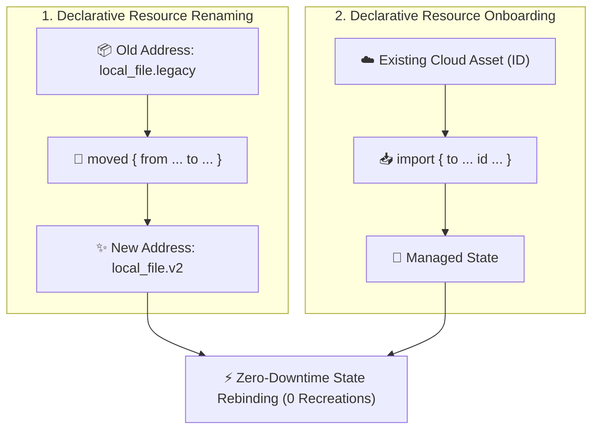

# Chapter 09: State Management & Refactoring Surgery

<div class="grid cards" markdown>

-   :material-school: **Topic Focus** &bull; Declarative State Surgery, `moved` Blocks, `import` Blocks, and Controlled Replacement
-   :material-api: **Primary Primitives** &bull; `moved`, `import`, `replace_triggered_by`, `state`
-   :material-rocket-launch: [**Launch Playground in Wasm →**](../playground/index.html?chapter=9){ .md-button .md-button--primary }

</div>

---

## 1. Architectural Overview & State Graph Surgery

In Terraform and OpenTofu, the **State File** binds declarative HCL resource addresses to real-world cloud infrastructure IDs. Refactoring resource names or module hierarchies historically required dangerous imperative CLI commands (`terraform state mv`). Modern HCL supports declarative, version-controlled state surgery via `moved` and `import` blocks.



Refactoring Capabilities:
1. **`moved` Blocks**: Rebind state keys during `plan` generation without destroying or recreating target infrastructure.
2. **`import` Blocks**: Bring unmanaged existing cloud resources into state declaratively as part of continuous integration.
3. **Controlled Replacement**: Use `replace_triggered_by` to trigger cascade replacements deterministically.

---

## 2. Annotated Production HCL Anatomy & Field Reference

Below is a production-grade configuration demonstrating state migrations from legacy names, collection refactoring from `count` to `for_each`, and declarative resource importing:

```hcl
# 1. Renaming a single resource safely
moved {
  from = terraform_data.legacy_database
  to   = terraform_data.primary_database
}

# 2. Migrating resources from count index to for_each string key
moved {
  from = terraform_data.legacy_instances[0]
  to   = terraform_data.instances["web-frontend"]
}

moved {
  from = terraform_data.legacy_instances[1]
  to   = terraform_data.instances["api-backend"]
}

# 3. Declarative Import of external pre-existing asset
import {
  to = terraform_data.external_registry
  id = "reg-external-corp-994"
}

resource "terraform_data" "primary_database" {
  input = {
    engine  = "postgres"
    storage = 100
  }
}

resource "terraform_data" "instances" {
  for_each = toset(["web-frontend", "api-backend"])
  input = {
    role = each.key
  }
}

resource "terraform_data" "external_registry" {
  input = {
    id   = "reg-external-corp-994"
    mode = "synced"
  }
}
```

### Key Field Schema Reference

| Field / Block | Type | Description |
| :--- | :--- | :--- |
| `moved { from, to }` | `Block` | Declaratively renames a resource or module address in state without destroying infrastructure. |
| `moved.from` | `Resource / Module Address` | The source address in the previous state file. |
| `moved.to` | `Resource / Module Address` | The new target address in current configuration. |
| `import { to, id }` | `Block` | Declaratively imports an unmanaged cloud asset into state during `apply`. |
| `import.to` | `Resource Address` | Target HCL resource block address to receive the imported state. |
| `import.id` | `String` | Provider-specific identifier or URI of the external resource in the cloud. |

---

## 3. Real-World Architectural Patterns

### Pattern 1: Moving Resources into a Child Module

```hcl
# Moving standalone VPC resources into a newly extracted module
moved {
  from = aws_vpc.main
  to   = module.networking.aws_vpc.main
}

moved {
  from = aws_subnet.public
  to   = module.networking.aws_subnet.public
}
```

### Pattern 2: Cascading Teardown with `replace_triggered_by`

```hcl
resource "terraform_data" "security_cert" {
  input = { cert_fingerprint = "sha256-abcdef123456" }
}

resource "terraform_data" "tls_terminator" {
  input = { host = "api.corp.net" }

  lifecycle {
    # Forces terminator replacement when security certificate updates
    replace_triggered_by = [
      terraform_data.security_cert.input["cert_fingerprint"]
    ]
  }
}
```

---

## 4. Production Hardening & Operational Governance

- **Never Use Imperative CLI State Moves in Production**: Prefer declarative `moved` blocks committed to Git. They document the refactoring history and execute reliably across all team member environments.
- **Retain `moved` Blocks Across Releases**: Keep `moved` blocks in your repository for several release cycles so all downstream environments and workspaces can migrate safely.
- **Review Plans for Unexpected Destructions**: If a planned refactor displays `- destroy` followed by `+ create` instead of `~ update in-place` or `moved`, verify your `moved` block addresses before applying.

---

## 5. Failure Modes & Diagnostic Triage Tree

??? failure "Error: Ambiguous or non-existent `from` address in `moved` block"
    **Root Cause:** The `from` address in a `moved` block does not match any resource found in the current state file.

    **Diagnostic Triage Sequence:**
    1. Inspect current state addresses with `tofu state list` or `terraform state list`.
    2. Ensure module prefixes match (e.g. `module.app.resource_name` vs `resource_name`).
    3. Verify index formats for `count` (`[0]`) versus `for_each` (`["key"]`).

??? failure "Error: Resource already managed by state during `import`"
    **Root Cause:** An `import` block targets a resource address that already exists in the state file.

    **Diagnostic Triage Sequence:**
    1. Check `terraform state list` for the target resource address.
    2. If the resource is already imported, remove the redundant `import` block.

---

## 6. Interactive Practice Matrix

Practice concepts from this chapter directly in the interactive WebAssembly sandbox:

| Exercise ID | Challenge Description | Direct Link | Action |
| :--- | :--- | :--- | :--- |
| **`state01`** | Declarative Refactoring with Moved Blocks | [`../playground/index.html?exercise=state01`](../playground/index.html?exercise=state01) | [**⚡ Solve in Playground →**](../playground/index.html?exercise=state01){ .md-button .md-button--primary } |
| **`state02`** | Migrating Count to For-Each with Moved Blocks | [`../playground/index.html?exercise=state02`](../playground/index.html?exercise=state02) | [**⚡ Solve in Playground →**](../playground/index.html?exercise=state02){ .md-button .md-button--primary } |
| **`state03`** | Declarative Import Blocks | [`../playground/index.html?exercise=state03`](../playground/index.html?exercise=state03) | [**⚡ Solve in Playground →**](../playground/index.html?exercise=state03){ .md-button .md-button--primary } |
| **`state04`** | Controlled Resource Replacement | [`../playground/index.html?exercise=state04`](../playground/index.html?exercise=state04) | [**⚡ Solve in Playground →**](../playground/index.html?exercise=state04){ .md-button .md-button--primary } |
