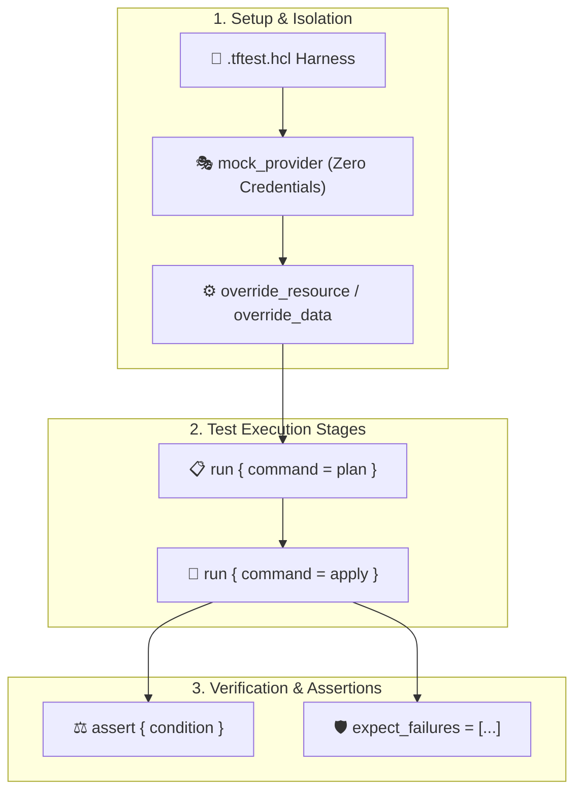

# Chapter 10: Native Unit & Integration Testing (.tftest.hcl)

<div class="grid cards" markdown>

-   :material-school: **Topic Focus** &bull; Native `.tftest.hcl` Test Suites, `run` Blocks, Assertions, Mocking, and Failure Tests
-   :material-api: **Primary Primitives** &bull; `run`, `assert`, `mock_provider`, `expect_failures`, `override_resource`
-   :material-rocket-launch: [**Launch Playground in Wasm →**](../playground/index.html?chapter=10){ .md-button .md-button--primary }

</div>

---

## 1. Architectural Overview & Test Framework Mechanics

In modern Terraform and OpenTofu, **Native Testing** executes via `.tftest.hcl` files. The testing framework provisions isolated ephemeral environments, mocks external cloud providers without credentials, runs assertion rules against planned or applied states, and verifies defensive failure paths.



### 🔍 Diagram Concept Breakdown

- **Setup & Mocking Isolation**:
  - **`.tftest.hcl` Test Files**: Declarative test suites orchestrated natively by `tofu test` / `terraform test`.
  - **`mock_provider`**: Intercepts external provider operations, returning synthetic attributes (such as mock AWS VPC IDs or GCP zones) to execute tests instantly without cloud credentials or network access.
  - **`override_resource` / `override_data`**: Stubs specific upstream data sources or resources with fixed test fixtures.
- **Test Execution Stages**:
  - **`run { command = plan }`**: Fast, in-memory unit testing that validates variable validation rules, local transformations, and planned attributes.
  - **`run { command = apply }`**: Integration testing that creates state in an isolated ephemeral workspace, evaluating computed attributes across multi-step deployments.
- **Verification & Assertions**:
  - **`assert { condition, error_message }`**: Verifies post-execution state against expected conditions (e.g. `assert { condition = aws_s3_bucket.logs.bucket_prefix == "prod-logs-" }`).
  - **`expect_failures = [var.port]`**: Negative testing asserting that invalid configurations trigger expected validation errors without halting the test harness.

---

## 2. Annotated Production HCL Anatomy & Field Reference

Below is a production-grade `.tftest.hcl` specification demonstrating plan-time assertions, provider mocking, and negative test verification:

```hcl
# tests/cluster_validation.tftest.hcl

# 1. Mock external cloud provider for isolated unit tests
mock_provider "aws" {}

# 2. Plan-time unit test block
run "validate_production_sizing" {
  command = plan

  variables = {
    environment = "production"
    cluster_size = 5
  }

  assert {
    condition     = terraform_data.cluster.input.desired_nodes == 5
    error_message = "Production cluster must initialize with exactly 5 nodes."
  }

  assert {
    condition     = terraform_data.cluster.input.tier == "enterprise"
    error_message = "Production cluster must use enterprise tier."
  }
}

# 3. Negative test asserting that invalid inputs are blocked
run "reject_invalid_cluster_size" {
  command = plan

  variables = {
    environment  = "production"
    cluster_size = 999  # Exceeds allowed limit
  }

  # Expect variable validation condition to trigger failure
  expect_failures = [
    var.cluster_size
  ]
}
```

### Key Test Schema Reference Table

| Field / Block | Type | Description |
| :--- | :--- | :--- |
| `run "<name>"` | `Block` | Declares a single test step executed sequentially within the test suite. |
| `run.command` | `String` | Test execution mode: `plan` (fast unit test) or `apply` (provisions resources). |
| `run.variables` | `Map` | Variables passed specifically to this test step. |
| `run.assert` | `Block` | Custom assertion condition that must evaluate to `true`. |
| `assert.condition` | `Boolean Expression` | Test assertion expression checking resource attributes or outputs. |
| `assert.error_message` | `String` | Explanation output if the assertion condition fails. |
| `mock_provider "<name>"` | `Block` | Mocks a provider plugin without requiring real cloud API credentials. |
| `expect_failures` | `List(References)` | Asserts that specific variables or resource checks fail validation. |

---

## 3. Real-World Architectural Patterns

### Pattern 1: Multi-Step Sequential Integration Test

```hcl
# Step 1: Create network foundation
run "setup_network" {
  command = apply
  variables = {
    enable_vpc = true
  }
}

# Step 2: Test dependent application deployment
run "deploy_application" {
  command = apply
  variables = {
    vpc_id = run.setup_network.vpc_id
  }

  assert {
    condition     = length(terraform_data.app_nodes) > 0
    error_message = "Application nodes failed to deploy into VPC."
  }
}
```

### Pattern 2: Mocking Computed Resource Attributes

```hcl
mock_provider "aws" {
  mock_data "aws_ami" {
    defaults = {
      id   = "ami-0123456789mock"
      name = "ubuntu-22.04-mocked"
    }
  }
}
```

---

## 4. Production Hardening & Operational Governance

- **Require Tests in CI**: Run `tofu test` or `terraform test` on every pull request to catch configuration regressions before merging.
- **Prefer `command = plan` for Unit Suites**: Fast plan-time tests execute in milliseconds and cover 90% of validation logic without incurring cloud costs.
- **Always Test Failure Scenarios**: Use `expect_failures` to ensure that custom `validation`, `precondition`, and `postcondition` blocks actually reject invalid input.

---

## 5. Failure Modes & Diagnostic Triage Tree

??? failure "Error: Test assertion failed (`assert { condition = ... }`)"
    **Root Cause:** The evaluated condition expression in an `assert` block returned `false`.

    **Diagnostic Triage Sequence:**
    1. Check the `error_message` printed by `tofu test`.
    2. Inspect the resource attributes evaluated during the test run.
    3. Verify variable inputs provided in the `run` block.

??? failure "Error: Expected failure was not observed (`expect_failures`)"
    **Root Cause:** A test step configured with `expect_failures` passed without triggering the expected validation error.

    **Diagnostic Triage Sequence:**
    1. Verify that the variable or resource listed in `expect_failures` actually has a `validation` block.
    2. Check that the input value passed in `variables` actually violates the validation condition.

---

## 6. Interactive Practice Matrix

Practice concepts from this chapter directly in the interactive WebAssembly sandbox:

| Exercise ID | Challenge Description | Direct Link | Action |
| :--- | :--- | :--- | :--- |
| **`test01`** | Basic Test Assertions with Run Blocks | [`../playground/index.html?exercise=test01`](../playground/index.html?exercise=test01) | [**⚡ Solve in Playground →**](../playground/index.html?exercise=test01){ .md-button .md-button--primary } |
| **`test02`** | Validating Applied Resources in Tests | [`../playground/index.html?exercise=test02`](../playground/index.html?exercise=test02) | [**⚡ Solve in Playground →**](../playground/index.html?exercise=test02){ .md-button .md-button--primary } |
| **`test03`** | Mocking Providers and Resources | [`../playground/index.html?exercise=test03`](../playground/index.html?exercise=test03) | [**⚡ Solve in Playground →**](../playground/index.html?exercise=test03){ .md-button .md-button--primary } |
| **`test04`** | Testing Failure Cases with Expect Failures | [`../playground/index.html?exercise=test04`](../playground/index.html?exercise=test04) | [**⚡ Solve in Playground →**](../playground/index.html?exercise=test04){ .md-button .md-button--primary } |
