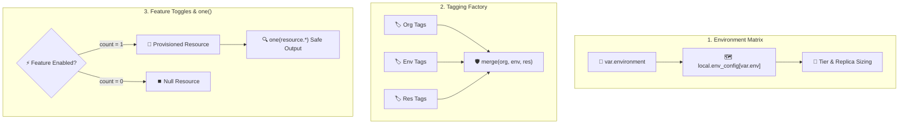

# Chapter 11: Production Patterns & Anti-Patterns

<div class="grid cards" markdown>

-   :material-school: **Topic Focus** &bull; Environment Maps, Feature Flags, Tagging Factories, and Self-Service Contracts
-   :material-api: **Primary Patterns** &bull; Lookup Matrices, Optional Resource Toggles, `merge()` Factories, Dynamic Contracts
-   :material-rocket-launch: [**Launch Playground in Wasm →**](../playground/index.html?chapter=11){ .md-button .md-button--primary }

</div>

---

## 1. Architectural Overview & Enterprise Design Patterns

In production Infrastructure as Code, codebases scale to support hundreds of engineers and diverse environments. **Enterprise Design Patterns** provide robust architectural blueprints to maintain clean separation of concerns, eliminate copy-pasted configuration, and enforce organizational governance.



### 🔍 Diagram Concept Breakdown

- **Environment Configuration Matrix**:
  - Replaces scattered, brittle `condition ? a : b` ternaries with a single, centralized lookup map in `locals` keyed by environment name (`dev`, `staging`, `prod`).
  - Standardizes cluster sizes, replica counts, instance tiers, and backup retention rules across all deployments.
- **Deterministic Tagging Factory**:
  - Enforces continuous governance and FinOps cost allocation by layering tags hierarchically: `merge(local.org_tags, local.env_tags, var.resource_tags)`.
  - Guarantees mandatory tags (`CostCenter`, `Environment`, `SecurityTier`, `ManagedBy`) are present on every resource without manual developer intervention.
- **Safe Feature Toggles & `one()` Pattern**:
  - Implements optional infrastructure components via `count = var.enable_waf ? 1 : 0`.
  - Uses `one(aws_wafv2_web_acl.main[*].arn)` to safely project either the single ARN (when enabled) or `null` (when disabled) into downstream inputs without crashing on empty list index lookups (`[0]`).

---

## 2. Annotated Production HCL Anatomy & Field Reference

Below is a production-grade configuration demonstrating environment mapping, tagging factories, and feature toggles:

```hcl
variable "environment" {
  type        = string
  description = "Target deployment environment tier."
  default     = "production"

  validation {
    condition     = contains(["dev", "staging", "production"], var.environment)
    error_message = "Allowed environments: dev, staging, production."
  }
}

variable "enable_waf" {
  type        = bool
  description = "Toggle Web Application Firewall integration."
  default     = true
}

variable "custom_tags" {
  type    = map(string)
  default = { Service = "Checkout" }
}

locals {
  # 1. Environment Configuration Matrix
  env_matrix = {
    dev = {
      instance_count = 1
      tier           = "basic"
      backup_retention = 7
    }
    staging = {
      instance_count = 2
      tier           = "standard"
      backup_retention = 14
    }
    production = {
      instance_count = 5
      tier           = "enterprise"
      backup_retention = 90
    }
  }

  active_config = local.env_matrix[var.environment]

  # 2. Layered Tagging Factory
  base_tags = {
    ManagedBy = "Terralings"
    Repo      = "infra-core"
  }

  environment_tags = {
    Environment = var.environment
    Tier        = local.active_config.tier
  }

  effective_tags = merge(
    local.base_tags,
    local.environment_tags,
    var.custom_tags
  )
}

# 3. Primary Scaled Workload
resource "terraform_data" "service_nodes" {
  count = local.active_config.instance_count

  input = {
    hostname = "app-${var.environment}-${count.index + 1}"
    tier     = local.active_config.tier
    tags     = local.effective_tags
  }
}

# 4. Feature-Flagged Optional Resource
resource "terraform_data" "waf_shield" {
  count = var.enable_waf ? 1 : 0

  input = {
    protection_tier = "advanced"
    target_nodes    = terraform_data.service_nodes[*].id
  }
}
```

---

## 3. Real-World Architectural Patterns

### Pattern 1: Safe Optional Extraction with `one()`

```hcl
# Safely extract optional single resource attribute without index error
output "waf_protection_id" {
  description = "WAF ID if enabled, or null if disabled."
  value       = one(terraform_data.waf_shield[*].id)
}
```

### Pattern 2: Self-Service Contract with Filter Predicates

```hcl
variable "developer_service_specs" {
  type = list(object({
    name     = string
    enabled  = bool
    protocol = string
  }))
  default = [
    { name = "auth",   enabled = true,  protocol = "grpc" },
    { name = "legacy", enabled = false, protocol = "http" }
  ]
}

# Filter only active services into deployment map
locals {
  active_services = {
    for s in var.developer_service_specs : s.name => s
    if s.enabled && s.protocol == "grpc"
  }
}
```

---

## 4. Production Hardening & Operational Governance

- **Avoid the "Blast Radius" Antipattern**: Do not place an entire corporate cloud estate into a single root module. Segment state files by lifecycle and domain (e.g., networking vs compute vs database).
- **Enforce Mandatory Tags**: Use the tagging factory pattern to guarantee `CostCenter`, `Owner`, and `Environment` tags are never omitted.
- **Never Use Workspaces for Long-Lived Environments**: Terraform/OpenTofu CLI workspaces share the same backend configuration. Use distinct directory structures (`envs/dev/`, `envs/prod/`) for true isolation.

---

## 5. Failure Modes & Diagnostic Triage Tree

??? failure "Error: Invalid index on optional resource (`resource[0].id` when count = 0)"
    **Root Cause:** Directly indexing `[0]` on a resource that was conditionally disabled with `count = 0`.

    **Diagnostic Triage Sequence:**
    1. Replace `resource[0].attr` with `one(resource[*].attr)`.
    2. `one()` safely returns `null` if the list is empty, and returns the single element if `count = 1`.

??? failure "Error: Key not found in environment matrix map"
    **Root Cause:** `var.environment` contains a value that does not match any key in the `env_matrix` dictionary.

    **Diagnostic Triage Sequence:**
    1. Add a `validation` block to `var.environment` restricting allowed values with `contains(["dev", ...], var.environment)`.
    2. Use `lookup(local.env_matrix, var.environment, local.env_matrix["dev"])` as a safe fallback.

---

## 6. Interactive Practice Matrix

Practice concepts from this chapter directly in the interactive WebAssembly sandbox:

| Exercise ID | Challenge Description | Direct Link | Action |
| :--- | :--- | :--- | :--- |
| **`pattern01`** | Multi-Environment Configuration Mapping | [`../playground/index.html?exercise=pattern01`](../playground/index.html?exercise=pattern01) | [**⚡ Solve in Playground →**](../playground/index.html?exercise=pattern01){ .md-button .md-button--primary } |
| **`pattern02`** | Feature Flags & Conditional Resource Creation | [`../playground/index.html?exercise=pattern02`](../playground/index.html?exercise=pattern02) | [**⚡ Solve in Playground →**](../playground/index.html?exercise=pattern02){ .md-button .md-button--primary } |
| **`pattern03`** | Tagging Factory Pattern | [`../playground/index.html?exercise=pattern03`](../playground/index.html?exercise=pattern03) | [**⚡ Solve in Playground →**](../playground/index.html?exercise=pattern03){ .md-button .md-button--primary } |
| **`pattern04`** | Self-Service Input Contracts | [`../playground/index.html?exercise=pattern04`](../playground/index.html?exercise=pattern04) | [**⚡ Solve in Playground →**](../playground/index.html?exercise=pattern04){ .md-button .md-button--primary } |
