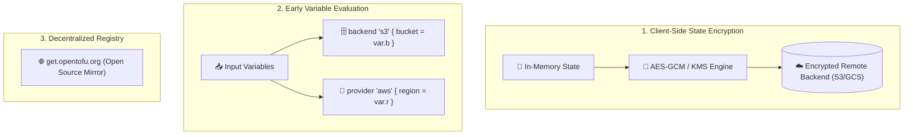

# Chapter 12: OpenTofu Innovations & Enterprise Features

<div class="grid cards" markdown>

-   :material-school: **Topic Focus** &bull; State Encryption at Rest, Early Variable Evaluation, and Open Registry Ecosystem
-   :material-api: **Primary Primitives** &bull; `encryption`, `key_provider`, `method`, `state`, `early_eval`
-   :material-rocket-launch: [**Launch Playground in Wasm →**](../playground/index.html?chapter=12){ .md-button .md-button--primary }

</div>

---

## 1. Architectural Overview & OpenTofu Engine Innovations

**OpenTofu** is an open-source, community-driven Infrastructure as Code engine under the Linux Foundation. OpenTofu introduces foundational architectural innovations including **End-to-End State Encryption at Rest**, **Early Variable Evaluation** in providers and backends, and an open, decentralized provider registry ecosystem.



Key Architectural Innovations:
1. **Native Client-Side State Encryption**: Encrypts sensitive state files, plan files, and state caches locally using AES-GCM or KMS key providers before any data is sent to remote backends.
2. **Early Variable Evaluation**: Allows input variables to be referenced directly inside `backend` and `provider` configuration blocks without requiring external wrapper scripts (e.g. Terragrunt).
3. **Open Registry Interoperability**: Seamlessly pulls provider plugins from the OpenTofu registry with automated fallback to community registries.

---

## 2. Annotated Production HCL Anatomy & Field Reference

Below is a production-grade OpenTofu configuration demonstrating native client-side state encryption with PBKDF2 and AES-GCM:

```hcl
terraform {
  required_version = ">= 1.7.0"

  # Native Client-Side State Encryption Block
  encryption {
    # 1. Key Provider (PBKDF2 Passphrase or KMS)
    key_provider "pbkdf2" "primary_key" {
      passphrase = "enterprise-master-encryption-passphrase-secure"
      key_length = 32
      iterations = 600000
      salt_length = 32
      hash_function = "sha512"
    }

    # 2. Encryption Cipher Method
    method "aes_gcm" "app_state_cipher" {
      keys = key_provider.pbkdf2.primary_key
    }

    # 3. Enforce Encryption on State Files & Plan Caches
    state {
      method   = method.aes_gcm.app_state_cipher
      enforced = true
    }

    plan {
      method   = method.aes_gcm.app_state_cipher
      enforced = true
    }
  }

  required_providers {
    terraform_data = {
      source  = "opentofu/terraform_data"
      version = "~> 1.0"
    }
  }
}

variable "deployment_region" {
  type    = string
  default = "eu-west-1"
}

resource "terraform_data" "encrypted_workload" {
  input = {
    region       = var.deployment_region
    db_password  = "super-secret-vault-token"
  }
}
```

### Key Encryption Field Schema Reference

| Field / Block | Type | Description |
| :--- | :--- | :--- |
| `encryption` | `Block` | Configures client-side encryption for state, plan, and cache data. |
| `key_provider "<type>" "<name>"` | `Block` | Key derivation provider (`pbkdf2`, `aws_kms`, `gcp_kms`, `azure_keyvault`). |
| `method "<type>" "<name>"` | `Block` | Encryption algorithm method (`aes_gcm`, `aes_cbc`). References a `key_provider`. |
| `state.method` | `Reference` | Designates the encryption method used to encrypt `.tfstate` files. |
| `state.enforced` | `Boolean` | When `true`, OpenTofu refuses to write unencrypted state. |
| `plan.method` | `Reference` | Designates the encryption method used to encrypt saved `.tfplan` files. |

---

## 3. Real-World Architectural Patterns

### Pattern 1: Early Variable Evaluation in Backend Blocks

```hcl
variable "environment" {
  type    = string
  default = "production"
}

# OpenTofu evaluates var.environment early during backend initialization
terraform {
  backend "local" {
    path = "state/${var.environment}/terraform.tfstate"
  }
}
```

### Pattern 2: Key Migration & Rotation Pipeline

```hcl
encryption {
  key_provider "pbkdf2" "key_v1" {
    passphrase = "old-passphrase-2025"
  }

  key_provider "pbkdf2" "key_v2" {
    passphrase = "new-rotated-passphrase-2026"
  }

  method "aes_gcm" "current_cipher" {
    # Primary key for new writes, fallback keys for decryption
    keys = [
      key_provider.pbkdf2.key_v2,
      key_provider.pbkdf2.key_v1
    ]
  }

  state {
    method = method.aes_gcm.current_cipher
  }
}
```

---

## 4. Production Hardening & Operational Governance

- **Enforce `enforced = true` on State Encryption**: Always set `enforced = true` in production to prevent accidental writes of unencrypted state files.
- **Store Passphrases in Environment Variables**: Never hardcode passphrases in `.tf` files; pass them via `TF_ENCRYPTION_PASSPHRASE` or use cloud KMS providers (`aws_kms`).
- **Plan Key Rotations Before Retirement**: When rotating encryption keys, supply both the new key and old keys in `keys = [...]` so historical state files can be decrypted before being re-encrypted with the new key.

---

## 5. Failure Modes & Diagnostic Triage Tree

??? failure "Error: Failed to decrypt state / Invalid encryption key"
    **Root Cause:** The key supplied to `key_provider` does not match the key that was used to encrypt the existing `.tfstate` file.

    **Diagnostic Triage Sequence:**
    1. Verify the passphrase or KMS key ARN in your environment variables.
    2. Check if a recent key rotation occurred without adding the legacy key to the fallback `keys = [...]` list.
    3. Ensure iterations and hash functions match the original configuration.

??? failure "Error: Encryption method not specified with `enforced = true`"
    **Root Cause:** State encryption was marked `enforced = true` but no valid `method` block was attached.

    **Diagnostic Triage Sequence:**
    1. Ensure `method = method.<type>.<name>` is correctly bound inside the `state { ... }` block.
    2. Verify that the referenced method is properly declared and references a valid `key_provider`.

---

## 6. Interactive Practice Matrix

Practice concepts from this chapter directly in the interactive WebAssembly sandbox:

| Exercise ID | Challenge Description | Direct Link | Action |
| :--- | :--- | :--- | :--- |
| **`tofu01`** | State Encryption at Rest | [`../playground/index.html?exercise=tofu01`](../playground/index.html?exercise=tofu01) | [**⚡ Solve in Playground →**](../playground/index.html?exercise=tofu01){ .md-button .md-button--primary } |
| **`tofu02`** | Early Variable Evaluation | [`../playground/index.html?exercise=tofu02`](../playground/index.html?exercise=tofu02) | [**⚡ Solve in Playground →**](../playground/index.html?exercise=tofu02){ .md-button .md-button--primary } |
| **`tofu03`** | OpenTofu Public Registry Integration | [`../playground/index.html?exercise=tofu03`](../playground/index.html?exercise=tofu03) | [**⚡ Solve in Playground →**](../playground/index.html?exercise=tofu03){ .md-button .md-button--primary } |
