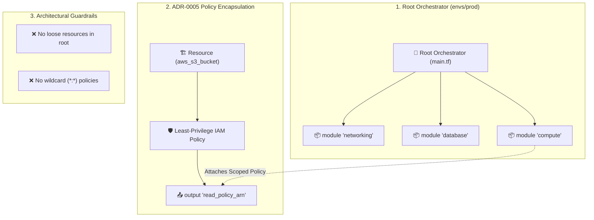

# Chapter 13: Architecture Governance & Enterprise Standards

<div class="grid cards" markdown>

-   :material-school: **Topic Focus** &bull; Root Module Encapsulation, Policy Encapsulation (ADR-0005), and Ephemeral Isolation
-   :material-api: **Primary Standards** &bull; Zero Loose Root Resources, Component-Owned Policies, Ephemeral Isolation
-   :material-rocket-launch: [**Launch Playground in Wasm →**](../playground/index.html?chapter=13){ .md-button .md-button--primary }

</div>

---

## 1. Architectural Overview & Governance Principles

Enterprise-scale Infrastructure as Code requires rigorous architectural governance. **Architecture Governance Standards** ensure repositories remain auditable, secure, and maintainable over years of operation.



### 🔍 Diagram Concept Breakdown

- **Root Orchestration Cleanliness**:
  - The root configuration file (`envs/prod/main.tf`) functions exclusively as an orchestrator that passes configuration arguments to discrete, single-purpose child modules (`networking`, `database`, `compute`).
  - **Zero Loose Root Resources Rule**: Direct `resource` declarations in the root namespace are strictly forbidden to prevent monolith sprawl and blast radius expansion.
- **ADR-0005 Policy Encapsulation**:
  - Security policies and IAM roles are declared in the same module that provisions the underlying resource (e.g. S3 module creates bucket + read-only IAM policy).
  - Child modules export scoped policy ARNs (`output "read_policy_arn"`), allowing downstream compute modules to attach least-privilege permissions without creating broad, insecure wildcard policies.
- **Continuous Architectural Guardrails**:
  - Automated CI linters and policy engines reject wildcard IAM statements (`Action = "*"`, `Resource = "*"`) and enforce ephemeral workload isolation to prevent state file bloat.

---

## 2. Annotated Production HCL Anatomy & Field Reference

Below is a production-grade configuration demonstrating root encapsulation and policy encapsulation (ADR-0005):

```hcl
# envs/production/main.tf - Clean Orchestrator Root Module

terraform {
  required_version = ">= 1.6.0"
  required_providers {
    terraform_data = {
      source  = "hashicorp/terraform_data"
      version = "~> 1.0"
    }
  }
}

variable "environment" {
  type    = string
  default = "production"
}

# 1. Encapsulated Storage Module (Owns the resource AND its access policy)
module "audit_storage" {
  source      = "./modules/audit_storage"
  bucket_name = "corp-compliance-audit-logs"
  environment = var.environment
}

# 2. Encapsulated Compute Module (Attaches storage-owned policy)
module "ingestion_worker" {
  source              = "./modules/worker"
  service_name        = "telemetry-ingestion"
  environment         = var.environment
  attached_policy_arn = module.audit_storage.read_write_policy_arn
}

# 3. Encapsulated Ephemeral Task Runner
module "batch_indexer" {
  source         = "./modules/ephemeral_task"
  task_name      = "nightly-audit-index"
  is_ephemeral   = true
  target_storage = module.audit_storage.bucket_arn
}
```

### Policy Encapsulation Interface (ADR-0005)

```hcl
# modules/audit_storage/outputs.tf

output "bucket_arn" {
  description = "The ARN of the managed audit bucket."
  value       = terraform_data.bucket.input.arn
}

output "read_write_policy_arn" {
  description = "Scoped IAM policy granting read/write access strictly to this bucket."
  value       = terraform_data.rw_policy.input.arn
}
```

---

## 3. Real-World Architectural Patterns

### Pattern 1: Component-Owned IAM Policy Scoping (ADR-0005)

```hcl
# modules/sqs_queue/main.tf
resource "terraform_data" "queue" {
  input = { name = "order-processing-queue" }
}

# Policy owned and exported by the queue module itself
resource "terraform_data" "producer_policy" {
  input = {
    name        = "OrderQueueProducerPolicy"
    statement   = "Allow SendMessage on ${terraform_data.queue.input.name}"
  }
}

output "producer_policy_arn" {
  value = terraform_data.producer_policy.id
}
```

### Pattern 2: Ephemeral Workload State Segregation

```hcl
# Isolating transient compute from long-lived persistent foundations
module "ephemeral_runner" {
  source        = "./modules/ephemeral_compute"
  ttl_minutes   = 120
  auto_teardown = true

  lifecycle {
    # Guarantees new runner is provisioned before old runner dies
    create_before_destroy = true
  }
}
```

---

## 4. Production Hardening & Operational Governance

- **Enforce Root Linter Checks**: Run automated AST checks to ensure zero top-level `resource` blocks are declared directly in environment root modules.
- **Eliminate Wildcard IAM Permissions**: Never grant `Action = "*"` or `Resource = "*"`. Let resource modules export their exact ARN policies to consumer services.
- **Automate Drift Detection**: Schedule continuous non-destructive `tofu plan -detailed-exitcode` cron pipelines to detect out-of-band changes before releases.

---

## 5. Failure Modes & Diagnostic Triage Tree

??? failure "Error: Architectural Governance Violation: Loose root resource detected"
    **Root Cause:** A `resource` block was declared directly in an environment directory rather than being encapsulated in a child module.

    **Diagnostic Triage Sequence:**
    1. Extract the resource declaration into an appropriate child module in `modules/`.
    2. Add input variables and export necessary outputs.
    3. Use a `moved` block to transition state from `resource.<name>` to `module.<name>.resource.<name>`.

??? failure "Error: Policy encapsulation breach: Cross-boundary IAM assignment"
    **Root Cause:** A compute module generated raw IAM policies referencing resources outside its domain boundary.

    **Diagnostic Triage Sequence:**
    1. Identify the target resource (e.g. S3 bucket or database).
    2. Move policy creation into the target resource's module.
    3. Export the policy ARN as a module output and pass it into the compute consumer.

---

## 6. Interactive Practice Matrix

Practice concepts from this chapter directly in the interactive WebAssembly sandbox:

| Exercise ID | Challenge Description | Direct Link | Action |
| :--- | :--- | :--- | :--- |
| **`gov01`** | Root Module Encapsulation | [`../playground/index.html?exercise=gov01`](../playground/index.html?exercise=gov01) | [**⚡ Solve in Playground →**](../playground/index.html?exercise=gov01){ .md-button .md-button--primary } |
| **`gov02`** | Policy Encapsulation (ADR-0005) | [`../playground/index.html?exercise=gov02`](../playground/index.html?exercise=gov02) | [**⚡ Solve in Playground →**](../playground/index.html?exercise=gov02){ .md-button .md-button--primary } |
| **`gov03`** | Ephemeral Workload Isolation | [`../playground/index.html?exercise=gov03`](../playground/index.html?exercise=gov03) | [**⚡ Solve in Playground →**](../playground/index.html?exercise=gov03){ .md-button .md-button--primary } |
