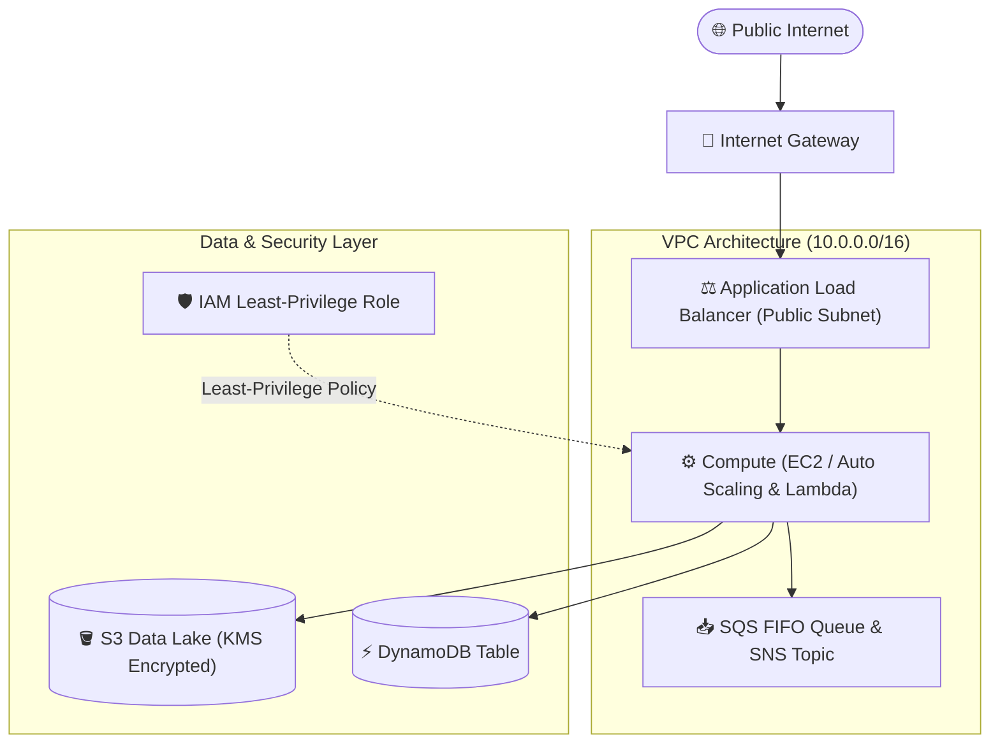

# Chapter 14: AWS Infrastructure & Production Blueprints

<div class="grid cards" markdown>

-   :material-school: **Topic Focus** &bull; VPC Multi-AZ Networking, Compute Scaling, Serverless Microservices, and IAM Zero-Trust
-   :material-api: **Primary Primitives** &bull; `aws_vpc`, `aws_subnet`, `aws_autoscaling_group`, `aws_lambda_function`, `aws_iam_role`, `aws_s3_bucket`
-   :material-rocket-launch: [**Launch Playground in Wasm →**](../playground/index.html?chapter=14){ .md-button .md-button--primary }

</div>

---

## 1. Architectural Overview & AWS Resource Dependency Graph

In production Amazon Web Services (AWS) architectures, Infrastructure as Code manages complex topological graphs connecting networking fabrics, resilient compute clusters, event brokers, and least-privilege security boundaries.



### 🔍 Diagram Concept Breakdown

- **Public Ingress & Perimeter Tier**:
  - The Internet Gateway (IGW) bridges public traffic into dual-AZ public subnets hosting the Application Load Balancer (ALB).
  - The ALB terminates SSL/TLS and balances traffic across target groups with continuous health checks.
- **Isolated VPC Compute & Messaging Fabric**:
  - Compute workloads (Auto Scaling Groups of EC2 instances and serverless Lambda functions) execute inside private subnets without public IP addresses, routing outbound traffic through NAT Gateways.
  - Asynchronous messaging (Amazon SNS topics and SQS FIFO queues with Dead-Letter Queues) decouples ingestion from heavy processing, absorbing traffic spikes.
- **Data & Security Layer**:
  - **Storage & Databases**: Encrypted persistence via Amazon S3 (protected by AWS KMS customer-managed keys) and Amazon DynamoDB with point-in-time recovery (PITR).
  - **IAM Security Boundary**: Scoped instance profiles and execution roles enforce least-privilege access, restricting IAM statements directly to explicit bucket and table ARNs without wildcard privileges (`*`).

---

## 2. Annotated Production HCL Anatomy & Field Reference

Below is a production-grade AWS infrastructure blueprint demonstrating VPC networking, compute scaling, and serverless event wiring:

```hcl
terraform {
  required_version = ">= 1.6.0"
  required_providers {
    aws = {
      source  = "hashicorp/aws"
      version = "~> 5.0"
    }
  }
}

variable "environment" {
  type    = string
  default = "production"
}

# 1. Multi-AZ Virtual Private Cloud (VPC)
resource "aws_vpc" "main" {
  cidr_block           = "10.0.0.0/16"
  enable_dns_hostnames = true
  enable_dns_support   = true

  tags = {
    Name        = "vpc-${var.environment}"
    Environment = var.environment
  }
}

# 2. Public & Private Subnets across AZs
resource "aws_subnet" "public_a" {
  vpc_id                  = aws_vpc.main.id
  cidr_block              = "10.0.1.0/24"
  availability_zone       = "us-east-1a"
  map_public_ip_on_launch = true

  tags = { Name = "public-1a-${var.environment}" }
}

resource "aws_subnet" "private_a" {
  vpc_id            = aws_vpc.main.id
  cidr_block        = "10.0.10.0/24"
  availability_zone = "us-east-1a"

  tags = { Name = "private-1a-${var.environment}" }
}

# 3. Internet Gateway for Public Egress
resource "aws_internet_gateway" "gw" {
  vpc_id = aws_vpc.main.id
  tags   = { Name = "igw-${var.environment}" }
}

# 4. Route Table and Explicit Associations
resource "aws_route_table" "public" {
  vpc_id = aws_vpc.main.id

  route {
    cidr_block = "0.0.0.0/0"
    gateway_id = aws_internet_gateway.gw.id
  }
}

resource "aws_route_table_association" "public_a" {
  subnet_id      = aws_subnet.public_a.id
  route_table_id = aws_route_table.public.id
}

# 5. Security Group with Strict Egress Rules
resource "aws_security_group" "app_tier" {
  name        = "app-tier-sg"
  description = "Security group for private application compute tier"
  vpc_id      = aws_vpc.main.id

  ingress {
    description = "Allow HTTPS from VPC"
    from_port   = 443
    to_port     = 443
    protocol    = "tcp"
    cidr_blocks = [aws_vpc.main.cidr_block]
  }

  egress {
    description = "Allow outbound Internet traffic"
    from_port   = 0
    to_port     = 0
    protocol    = "-1"
    cidr_blocks = ["0.0.0.0/0"]
  }
}

# 6. S3 Bucket with SSE-KMS & Public Access Block
resource "aws_s3_bucket" "data_lake" {
  bucket        = "corp-data-lake-${var.environment}-0091"
  force_destroy = false
}

resource "aws_s3_bucket_public_access_block" "data_lake_guard" {
  bucket                  = aws_s3_bucket.data_lake.id
  block_public_acls       = true
  block_public_policy     = true
  ignore_public_acls      = true
  restrict_public_buckets = true
}
```

### Key Field Schema Reference

| Resource / Block | Argument / Attribute | Type | Description |
| :--- | :--- | :--- | :--- |
| `aws_vpc` | `cidr_block` | `string` | The primary IPv4 address range for the VPC (e.g. `10.0.0.0/16`). |
| `aws_vpc` | `enable_dns_hostnames` | `bool` | Enables assignation of public DNS hostnames to instances. |
| `aws_subnet` | `map_public_ip_on_launch`| `bool` | When `true`, instances launched into the subnet receive public IPs. |
| `aws_route_table` | `route` | `block` | Routing rules directing traffic (e.g., `0.0.0.0/0` via `gateway_id`). |
| `aws_security_group` | `ingress` / `egress` | `block` | Statefully filtered inbound and outbound traffic rules. |
| `aws_autoscaling_group` | `min_size` / `max_size` | `number` | Boundary thresholds for dynamic cluster capacity scaling. |
| `aws_lambda_function` | `handler` / `runtime` | `string` | Entrypoint method and execution environment (e.g. `python3.12`). |
| `aws_dynamodb_table` | `billing_mode` | `string` | Sizing model: `PAY_PER_REQUEST` (on-demand) or `PROVISIONED`. |

---

## 3. Real-World Architectural Patterns

### Pattern 1: Resilient Compute with ALB and Auto Scaling Groups

```hcl
# Launch template defining machine image and instance configurations
resource "aws_launch_template" "web" {
  name_prefix   = "web-template-"
  image_id      = "ami-0123456789abcdef0"
  instance_type = "t3.medium"

  network_interfaces {
    associate_public_ip_address = false
    security_groups             = [aws_security_group.app_tier.id]
  }

  user_data = base64encode(<<-EOF
              #!/bin/bash
              echo "Starting App Service..."
              EOF
  )
}

# Auto Scaling Group orchestrating instances across multiple subnets
resource "aws_autoscaling_group" "web" {
  name_prefix         = "web-asg-"
  vpc_zone_identifier = [aws_subnet.private_a.id]
  target_group_arns   = [aws_lb_target_group.web.arn]
  health_check_type   = "ELB"
  min_size            = 2
  max_size            = 10
  desired_capacity    = 4

  launch_template {
    id      = aws_launch_template.web.id
    version = "$Latest"
  }
}

resource "aws_lb_target_group" "web" {
  name     = "web-tg"
  port     = 80
  protocol = "HTTP"
  vpc_id   = aws_vpc.main.id

  health_check {
    path                = "/healthz"
    matcher             = "200"
    interval            = 30
    timeout             = 5
    healthy_threshold   = 3
    unhealthy_threshold = 3
  }
}
```

### Pattern 2: Serverless HTTP Microservice with API Gateway & Lambda

```hcl
# IAM Role for Lambda Execution
resource "aws_iam_role" "lambda_exec" {
  name = "serverless-lambda-exec"

  assume_role_policy = jsonencode({
    Version = "2012-10-17"
    Statement = [{
      Action    = "sts:AssumeRole"
      Effect    = "Allow"
      Principal = { Service = "lambda.amazonaws.com" }
    }]
  })
}

# Lambda Microservice
resource "aws_lambda_function" "api_worker" {
  function_name = "order-processor"
  role          = aws_iam_role.lambda_exec.arn
  runtime       = "python3.12"
  handler       = "index.handler"
  filename      = "dist/function.zip"
  timeout       = 15
  memory_size   = 256
}

# HTTP API Gateway v2
resource "aws_apigatewayv2_api" "http_gw" {
  name          = "microservices-api"
  protocol_type = "HTTP"
}

resource "aws_apigatewayv2_integration" "lambda_link" {
  api_id           = aws_apigatewayv2_api.http_gw.id
  integration_type = "AWS_PROXY"
  integration_uri  = aws_lambda_function.api_worker.invoke_arn
}
```

---

## 4. Production Hardening & Operational Governance

- **Always Enable S3 Public Access Blocks**: Attach `aws_s3_bucket_public_access_block` to all buckets to prevent data leakage from accidental ACL changes.
- **Enforce State Encryption with SSE-KMS**: Use dedicated AWS KMS keys with automatic key rotation for S3, EBS, and DynamoDB data encryption.
- **Never Hardcode Secrets in Lambda Environment Variables**: Retrieve database credentials and API tokens dynamically from AWS Secrets Manager or SSM Parameter Store.
- **Use FIFO Queues for Strict Ordering**: When message deduplication and transactional ordering are required, configure `aws_sqs_queue` with `fifo_queue = true` and `.fifo` naming.

---

## 5. Failure Modes & Diagnostic Triage Tree

??? failure "Error: SubnetCIDRBlockOverlap: CIDR address block conflicts with existing subnet"
    **Root Cause:** Attempting to create a subnet whose CIDR range overlaps with another subnet in the same VPC.

    **Diagnostic Triage Sequence:**
    1. Inspect the VPC CIDR (e.g. `10.0.0.0/16`).
    2. Use `cidrsubnet(aws_vpc.main.cidr_block, 8, <index>)` to calculate non-overlapping subnet blocks deterministically.
    3. Ensure Subnet A (`10.0.1.0/24`) and Subnet B (`10.0.2.0/24`) have unique network addresses.

??? failure "Error: AccessDenied: IAM Role lacks sts:AssumeRole permissions"
    **Root Cause:** The `assume_role_policy` JSON does not grant trust to the requesting AWS service (e.g. `lambda.amazonaws.com` or `ec2.amazonaws.com`).

    **Diagnostic Triage Sequence:**
    1. Inspect the `assume_role_policy` argument on `aws_iam_role`.
    2. Verify that `Principal.Service` specifies the exact AWS service identifier.
    3. Ensure `Action` includes `"sts:AssumeRole"`.

---

## 6. Interactive Practice Matrix

Practice concepts from this chapter directly in the interactive WebAssembly sandbox:

| Exercise ID | Challenge Description | Direct Link | Action |
| :--- | :--- | :--- | :--- |
| **`aws01`** | Multi-AZ VPC Networking | [`../playground/index.html?exercise=aws01`](../playground/index.html?exercise=aws01) | [**⚡ Solve in Playground →**](../playground/index.html?exercise=aws01){ .md-button .md-button--primary } |
| **`aws02`** | Resilient Compute & Load Balancing | [`../playground/index.html?exercise=aws02`](../playground/index.html?exercise=aws02) | [**⚡ Solve in Playground →**](../playground/index.html?exercise=aws02){ .md-button .md-button--primary } |
| **`aws03`** | Serverless Microservice Pipeline | [`../playground/index.html?exercise=aws03`](../playground/index.html?exercise=aws03) | [**⚡ Solve in Playground →**](../playground/index.html?exercise=aws03){ .md-button .md-button--primary } |
| **`aws04`** | Event-Driven Async Decoupling | [`../playground/index.html?exercise=aws04`](../playground/index.html?exercise=aws04) | [**⚡ Solve in Playground →**](../playground/index.html?exercise=aws04){ .md-button .md-button--primary } |
| **`aws05`** | Zero-Trust IAM & Security Hardening | [`../playground/index.html?exercise=aws05`](../playground/index.html?exercise=aws05) | [**⚡ Solve in Playground →**](../playground/index.html?exercise=aws05){ .md-button .md-button--primary } |
| **`aws06`** | Storage & Data Tier Architecture | [`../playground/index.html?exercise=aws06`](../playground/index.html?exercise=aws06) | [**⚡ Solve in Playground →**](../playground/index.html?exercise=aws06){ .md-button .md-button--primary } |
