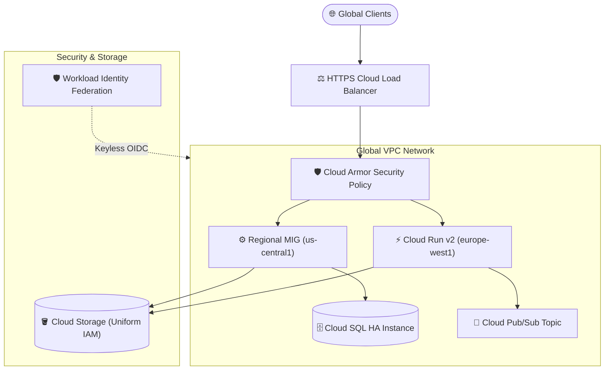

# Chapter 15: Google Cloud (GCP) Architecture Blueprints

<div class="grid cards" markdown>

-   :material-school: **Topic Focus** &bull; Custom VPCs, Firewalls, Managed Instance Groups, Cloud Run v2, and Workload Identity
-   :material-api: **Primary Primitives** &bull; `google_compute_network`, `google_compute_subnetwork`, `google_cloud_run_v2_service`, `google_pubsub_topic`, `google_service_account`
-   :material-rocket-launch: [**Launch Playground in Wasm →**](../playground/index.html?chapter=15){ .md-button .md-button--primary }

</div>

---

## 1. Architectural Overview & GCP Resource Hierarchy

Google Cloud Platform (GCP) structures infrastructure through an explicit organizational resource hierarchy (**Organization &rarr; Folder &rarr; Project &rarr; Regional Resources**). In GCP, Virtual Private Clouds (VPCs) are global software-defined networks with regional subnet allocations and tag-based firewall enforcement.



### 🔍 Diagram Concept Breakdown

- **Global Ingress & Edge Protection Tier**:
  - Global External HTTPS Cloud Load Balancer (GCLB) routes anycast client traffic to the closest Google edge Point of Presence (PoP).
  - Google Cloud Armor filters malicious traffic with Layer 7 DDoS mitigation, IP allowlists, and WAF rule sets before packets reach internal workloads.
- **Global VPC Network Topology**:
  - A single Global VPC spans multiple regions (`us-central1`, `europe-west1`), avoiding complex multi-region peering tunnels.
  - Regional Managed Instance Groups (MIG) deliver auto-healing VM fleets across multiple zones.
  - Cloud Run v2 executes containerized microservices that communicate with private backend services via Serverless VPC Access Connectors.
  - Highly available Cloud SQL instances connect over Private Services Access (PSA) using internal RFC 1918 IP addresses.
  - Cloud Pub/Sub decouples event-driven microservices across regions.
- **Security & Storage Fabric**:
  - Google Cloud Storage (GCS) enforces Uniform Bucket-Level Access, CMEK encryption, and object lifecycle transitions.
  - Keyless Workload Identity Federation (WIF) allows GitHub Actions / CI runners to exchange OIDC tokens for ephemeral GCP access tokens, completely eliminating static service account JSON keys.

---

## 2. Annotated Production HCL Anatomy & Field Reference

Below is a production-grade Google Cloud infrastructure blueprint demonstrating custom VPC networking, firewall rules, Cloud Run services, and Pub/Sub event messaging:

```hcl
terraform {
  required_version = ">= 1.6.0"
  required_providers {
    google = {
      source  = "hashicorp/google"
      version = "~> 5.0"
    }
  }
}

variable "project_id" {
  type        = string
  description = "Target Google Cloud Project ID."
  default     = "production-core-889"
}

variable "region" {
  type    = string
  default = "us-central1"
}

# 1. Custom Global VPC Network
resource "google_compute_network" "custom_vpc" {
  name                    = "vpc-production"
  auto_create_subnetworks = false
  project                 = var.project_id
}

# 2. Regional Subnetwork with Private Google Access
resource "google_compute_subnetwork" "app_subnet" {
  name                     = "subnet-us-central1-app"
  ip_cidr_range            = "10.10.0.0/20"
  region                   = var.region
  network                  = google_compute_network.custom_vpc.id
  private_ip_google_access = true
  project                  = var.project_id
}

# 3. Tag-Filtered Firewall Rule
resource "google_compute_firewall" "allow_internal_https" {
  name    = "allow-internal-https"
  network = google_compute_network.custom_vpc.name
  project = var.project_id

  allow {
    protocol = "tcp"
    ports    = ["443", "8443"]
  }

  source_ranges = [google_compute_subnetwork.app_subnet.ip_cidr_range]
  target_tags   = ["app-backend"]
}

# 4. Scoped Service Account
resource "google_service_account" "runner_sa" {
  account_id   = "cloudrun-processor-sa"
  display_name = "Cloud Run Microservice Identity"
  project      = var.project_id
}

# 5. Cloud Run v2 Serverless Service
resource "google_cloud_run_v2_service" "api_service" {
  name     = "orders-api"
  location = var.region
  project  = var.project_id

  template {
    service_account = google_service_account.runner_sa.email

    containers {
      image = "us-docker.pkg.dev/cloudrun/container/hello"
      resources {
        limits = {
          cpu    = "2"
          memory = "1024Mi"
        }
      }
    }

    scaling {
      min_instance_count = 1
      max_instance_count = 20
    }
  }

  traffic {
    type    = "TRAFFIC_TARGET_ALLOCATION_TYPE_LATEST"
    percent = 100
  }
}

# 6. Cloud Storage Bucket with Uniform Access
resource "google_storage_bucket" "artifacts" {
  name                        = "corp-artifacts-${var.project_id}"
  location                    = "US"
  project                     = var.project_id
  uniform_bucket_level_access = true
  force_destroy               = false

  versioning {
    enabled = true
  }
}
```

### Key Field Schema Reference

| Resource / Block | Argument / Attribute | Type | Description |
| :--- | :--- | :--- | :--- |
| `google_compute_network` | `auto_create_subnetworks` | `bool` | Must be `false` for enterprise custom VPC architectures. |
| `google_compute_subnetwork` | `private_ip_google_access` | `bool` | Allows VMs to reach Google APIs without external public IPs. |
| `google_compute_firewall` | `target_tags` | `list(string)` | Instance network tags that this firewall rule applies to. |
| `google_cloud_run_v2_service` | `template.scaling.max_instance_count` | `number` | Upper autoscaling boundary for container instances. |
| `google_pubsub_subscription` | `ack_deadline_seconds` | `number` | Maximum time allowed for subscriber to acknowledge a message. |
| `google_storage_bucket` | `uniform_bucket_level_access` | `bool` | Enforces IAM-only permissions, disabling object ACLs. |

---

## 3. Real-World Architectural Patterns

### Pattern 1: Regional Managed Instance Group (MIG) with Health Checks

```hcl
# Compute Instance Template
resource "google_compute_instance_template" "worker" {
  name_prefix  = "worker-template-"
  machine_type = "e2-standard-4"
  project      = var.project_id

  disk {
    source_image = "debian-cloud/debian-12"
    auto_delete  = true
    boot         = true
  }

  network_interface {
    subnetwork = google_compute_subnetwork.app_subnet.id
  }

  tags = ["app-backend"]

  lifecycle {
    create_before_destroy = true
  }
}

# Regional Managed Instance Group (Multi-Zone Resiliency)
resource "google_compute_region_instance_group_manager" "mig" {
  name               = "app-worker-mig"
  base_instance_name = "worker"
  region             = var.region
  project            = var.project_id
  target_size        = 3

  version {
    instance_template = google_compute_instance_template.worker.id
  }

  auto_healing_policies {
    health_check      = google_compute_health_check.http.id
    initial_delay_sec = 300
  }
}

resource "google_compute_health_check" "http" {
  name    = "worker-health-check"
  project = var.project_id

  http_health_check {
    port = 8080
    request_path = "/healthz"
  }
}
```

### Pattern 2: Cloud Pub/Sub Pipeline with Dead-Letter Handling

```hcl
# Main Ingestion Topic
resource "google_pubsub_topic" "events" {
  name    = "telemetry-events"
  project = var.project_id
}

# Dead-Letter Topic for Errored Messages
resource "google_pubsub_topic" "events_deadletter" {
  name    = "telemetry-events-dlq"
  project = var.project_id
}

# Subscription with Automated Dead-Letter Routing
resource "google_pubsub_subscription" "event_subscriber" {
  name    = "telemetry-worker-sub"
  topic   = google_pubsub_topic.events.name
  project = var.project_id

  ack_deadline_seconds = 20

  dead_letter_policy {
    dead_letter_topic     = google_pubsub_topic.events_deadletter.id
    max_delivery_attempts = 5
  }
}
```

---

## 4. Production Hardening & Operational Governance

- **Enforce Uniform Bucket-Level Access**: Always set `uniform_bucket_level_access = true` on `google_storage_bucket` to unify access control under Google Cloud IAM.
- **Never Generate Service Account Keys**: Prefer Workload Identity Federation for external systems and Workload Identity for GKE clusters to avoid credential leakage.
- **Enable Private Google Access on Subnets**: Ensure `private_ip_google_access = true` so internal backend workloads can communicate with Cloud Storage and BigQuery securely over Google's internal fiber network.
- **Use Regional Managed Instance Groups**: Distribute VM capacity across multiple zones in a region to maintain high availability during single-zone outages.

---

## 5. Failure Modes & Diagnostic Triage Tree

??? failure "Error: Error 403: The caller does not have permission (IAM Policy Binding)"
    **Root Cause:** The service account or caller identity lacks required IAM roles on the project or resource.

    **Diagnostic Triage Sequence:**
    1. Inspect the `google_project_iam_member` declarations.
    2. Ensure the role name follows the canonical format (e.g. `roles/run.invoker`, `roles/pubsub.publisher`).
    3. Verify that `member = "serviceAccount:${google_service_account.<name>.email}"` includes the `serviceAccount:` prefix.

??? failure "Error: Invalid CIDR range in `google_compute_subnetwork`"
    **Root Cause:** Subnet CIDR overlaps with another subnetwork in the same VPC or uses an invalid RFC 1918 mask.

    **Diagnostic Triage Sequence:**
    1. Check all subnets attached to `google_compute_network`.
    2. Ensure each region uses a distinct CIDR block (e.g., `10.10.0.0/20` for `us-central1` and `10.20.0.0/20` for `europe-west1`).

---

## 6. Interactive Practice Matrix

Practice concepts from this chapter directly in the interactive WebAssembly sandbox:

| Exercise ID | Challenge Description | Direct Link | Action |
| :--- | :--- | :--- | :--- |
| **`gcp01`** | Custom VPC Networking & Firewalls | [`../playground/index.html?exercise=gcp01`](../playground/index.html?exercise=gcp01) | [**⚡ Solve in Playground →**](../playground/index.html?exercise=gcp01){ .md-button .md-button--primary } |
| **`gcp02`** | Managed Instance Groups & Load Balancing | [`../playground/index.html?exercise=gcp02`](../playground/index.html?exercise=gcp02) | [**⚡ Solve in Playground →**](../playground/index.html?exercise=gcp02){ .md-button .md-button--primary } |
| **`gcp03`** | Serverless Cloud Run Services | [`../playground/index.html?exercise=gcp03`](../playground/index.html?exercise=gcp03) | [**⚡ Solve in Playground →**](../playground/index.html?exercise=gcp03){ .md-button .md-button--primary } |
| **`gcp04`** | Pub/Sub Event Pipelines | [`../playground/index.html?exercise=gcp04`](../playground/index.html?exercise=gcp04) | [**⚡ Solve in Playground →**](../playground/index.html?exercise=gcp04){ .md-button .md-button--primary } |
| **`gcp05`** | Workload Identity & IAM Federation | [`../playground/index.html?exercise=gcp05`](../playground/index.html?exercise=gcp05) | [**⚡ Solve in Playground →**](../playground/index.html?exercise=gcp05){ .md-button .md-button--primary } |
| **`gcp06`** | Resilient Storage & Cloud Databases | [`../playground/index.html?exercise=gcp06`](../playground/index.html?exercise=gcp06) | [**⚡ Solve in Playground →**](../playground/index.html?exercise=gcp06){ .md-button .md-button--primary } |
