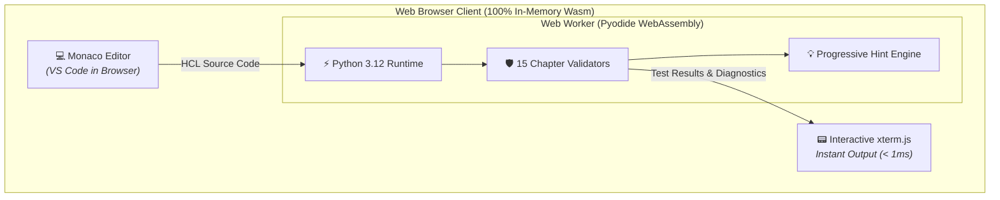

# Terralings 🌍

**An interactive, client-side WebAssembly learning platform and comprehensive reference manual for Terraform & OpenTofu.**

---

## ⚡ The Modern Way to Master Infrastructure as Code

Terralings combines a **zero-install, 100% client-side WebAssembly interactive playground** with **15 comprehensive architectural reference guides** spanning the entire Terraform & OpenTofu ecosystem.

-   :material-play-circle-outline: **Zero-Install Web IDE**
    ---
    Run Monaco Editor, Pyodide WebAssembly, and real-time HCL validation 100% in your browser. No cloud credentials, no local binary installs, and zero backend servers required.
    
    [**Launch Playground →**](playground/index.html){ .md-button .md-button--primary }

-   :material-book-open-page-variant-outline: **15-Chapter Reference Manual**
    ---
    Deep architectural documentation, annotated HCL specs, production best practices, and state surgery workflows for modern IaC.

    [**Explore Reference Guides →**](#-comprehensive-15-chapter-reference-guides){ .md-button }

---

## 📚 Comprehensive 15-Chapter Reference Guides

Explore in-depth architectural guides and launch linked practice exercises directly into the playground:

-   ### Core HCL & Data Flow
    ---
    - [**01. HCL Foundations & Core Primitives**](guides/01-primitives.md) &bull; Blocks, provider constraints, resources, heredocs, lifecycle
    - [**02. Input Variables, Types & Validations**](guides/02-variables.md) &bull; Primitives, collections, objects, custom validation rules
    - [**03. Outputs, Locals & Expressions**](guides/03-outputs-locals.md) &bull; Outputs, sensitive masking, locals, ternaries, splat expressions
    - [**04. Built-in Functions & Collections**](guides/04-functions.md) &bull; String ops, collection math, encoding, files, `try`/`can`

-   ### Dynamic Logic & Modules
    ---
    - [**05. Meta-Arguments & Scaling**](guides/05-meta-arguments.md) &bull; `count`, `for_each`, `depends_on`, lifecycle rules, replacement triggers
    - [**06. Dynamic Blocks & Advanced HCL**](guides/06-dynamic-blocks.md) &bull; `dynamic` block generators, custom iterators, nested loops
    - [**07. Data Sources & State Querying**](guides/07-data-sources.md) &bull; Local files, archive zips, external scripts, preconditions
    - [**08. Modular Infrastructure Architecture**](guides/08-modules.md) &bull; Child modules, multi-instance calling, provider aliases

-   ### State Surgery, Testing & Governance
    ---
    - [**09. State Management & Refactoring Surgery**](guides/09-state-management.md) &bull; Declarative `moved` blocks, `import` blocks, replacements
    - [**10. Native Unit & Integration Testing**](guides/10-testing.md) &bull; `.tftest.hcl`, `run` blocks, mocks, `expect_failures`
    - [**11. Production Patterns & Anti-Patterns**](guides/11-production-patterns.md) &bull; Environment mapping, feature flags, tagging factories
    - [**12. OpenTofu Innovations & Enterprise**](guides/12-opentofu.md) &bull; State encryption at rest, key providers, open registries
    - [**13. Architecture Governance & Standards**](guides/13-governance.md) &bull; Root encapsulation, policy scoping, ephemeral isolation

-   ### Cloud Architecture Blueprints
    ---
    - [**14. AWS Infrastructure & Blueprints**](guides/14-aws-architecture.md) &bull; VPCs, EC2/ASG, Serverless Lambda, S3, IAM roles
    - [**15. Google Cloud (GCP) Blueprints**](guides/15-gcp-architecture.md) &bull; Custom VPC, MIG load balancing, Cloud Run, Pub/Sub, Workload Identity

---

## 💡 How the Playground Works

The Terralings web playground runs entirely on client-side WebAssembly technology:

---

## 🚀 Quick Navigation

-   :material-laptop: **Interactive Playground**
    ---
    Dive straight into the browser IDE with real-time feedback.
    
    [Open Playground →](playground/index.html)

-   :material-format-list-numbered: **Curriculum Syllabus**
    ---
    View the complete breakdown of all 68 exercises and concepts.
    
    [Explore Syllabus →](syllabus.md)

-   :material-github: **Contribute on GitHub**
    ---
    Add new exercises, improve validators, or submit guides.
    
    [Contributing Guide →](contributing.md)

